## Načrt sistema

| | |
|:---|:---|
| **Naziv projekta** | StraightAs |
| **Člani projektne skupine** | David Nabergoj, Darian Tomašević, Luka Vranješ, Andrej Miščič |
| **Kraj in datum** | Ljubljana, april 2019 |


## Povzetek

Načrt sistema je organiziran v 3 razdelke. Načrt arhitekture vsebuje celoten logični in razvojni pogled. 
Logični pogled predstavlja splošen pregled nad arhitekturo sistema, medtem ko so podsistemi še dodatno natančneje prikazani.
Drugi razdelek vsebuje načrt strukture katerega predstavimo z razrednim diagramom sistema. Za boljšo preglednost imamo poleg 
celotnega razrednega diagrama podane še razredne diagrame za posamezne interakcije ter opise vseh razredov. 
Načrt obnašanja, ki se nahaja v zadnjem razdelku smo prikazali z diagrami zaporedja interakcij.


## 1. Načrt arhitekture

V tem razdelku sta z diagrami predstavljena logični in razvojni pogled na arhitekturo sistema.

### Logični pogled

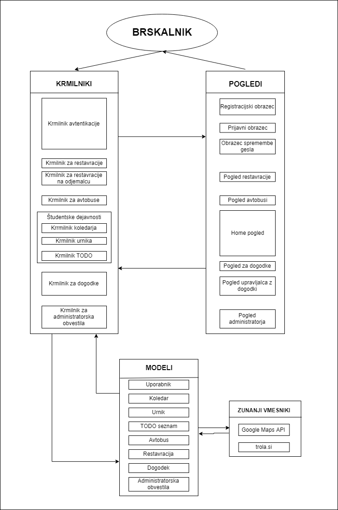

Natančneje prikazani posamezni podsistemi:

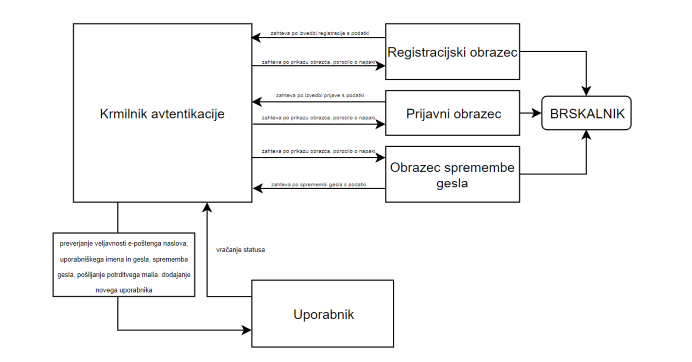

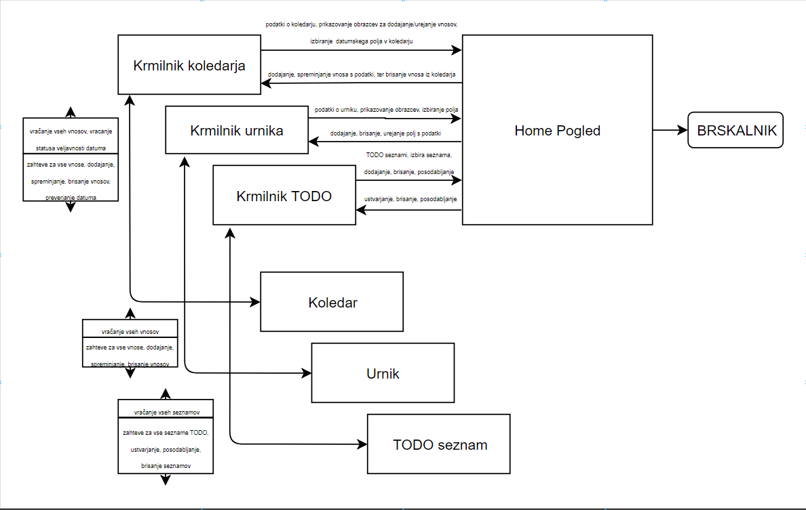


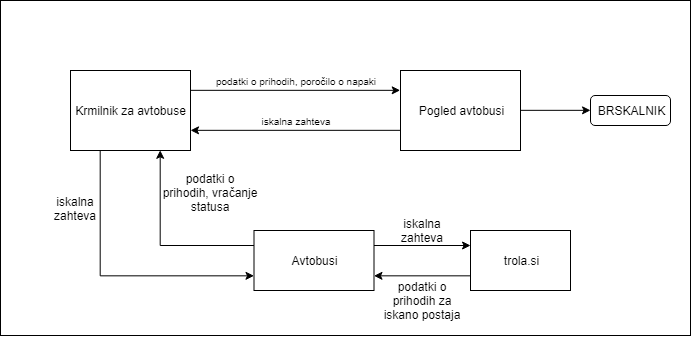

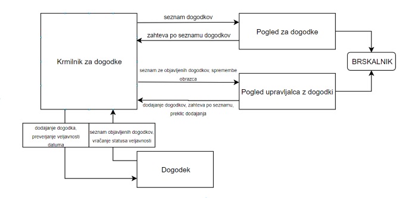

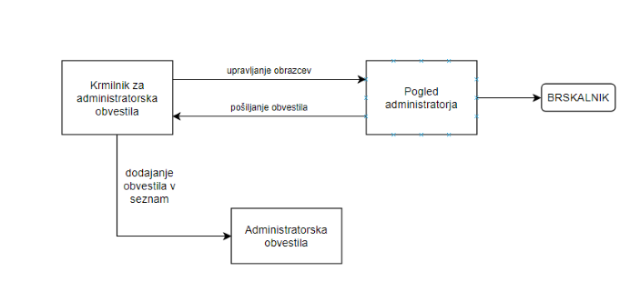

---

### Razvojni pogled

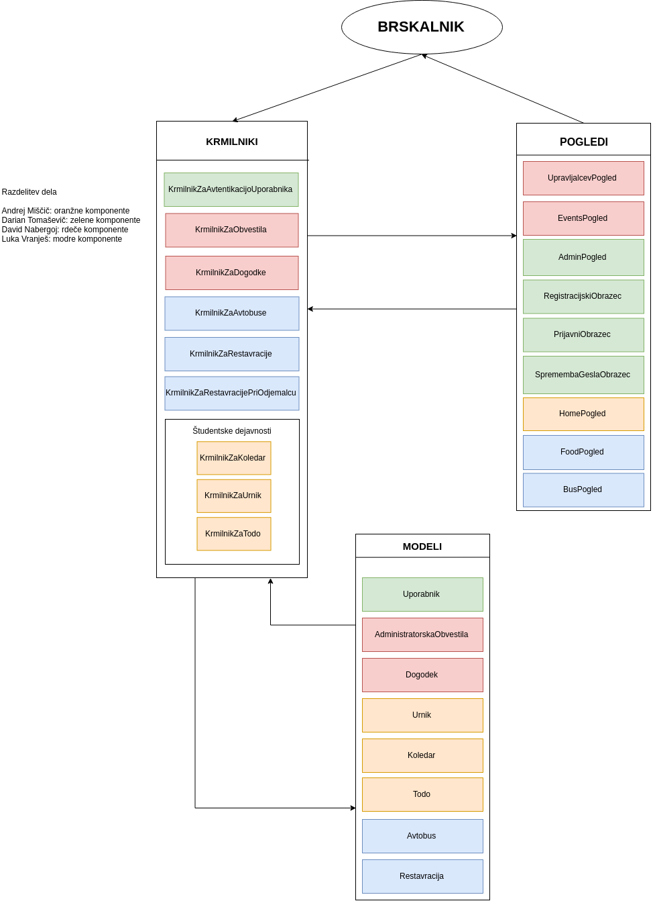

## 2. Načrt strukture

V tem razdelku je z razrednimi diagrami in opisi posameznih razredov predstavljena podrobnejša struktura sistema.

### 2.1 Razredni diagram

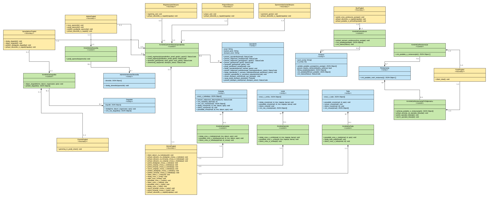

### 2.2 Razredni diagrami za posamezne interakcije

#### Razredni diagram za registracijo (akter: neregistriran uporabnik, funkcionalnost: registracija).
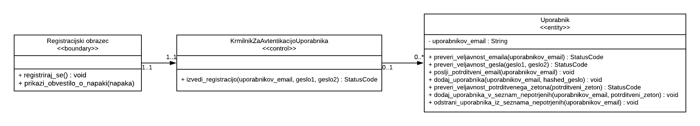

#### Razredni diagram za prijavo (akter: registriran uporabnik, administrator ali upravljalec dogodkov, funkcionalnost: prijava).
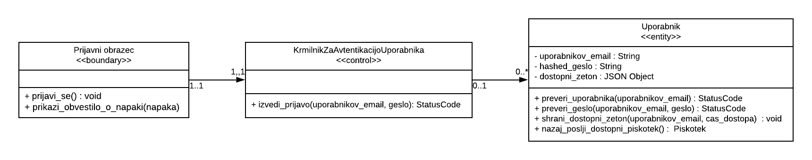

#### Razredni diagram za spremembo gesla (akter: registriran uporabnik, funkcionalnost: sprememba gesla).
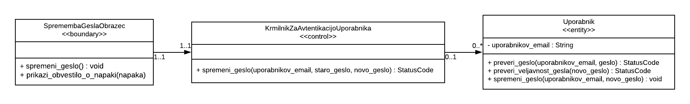

#### Razredni diagram za objavljanje dogodkov (akter: upravljalec z dogodki, funkcionalnost: objavljanje dogodkov).
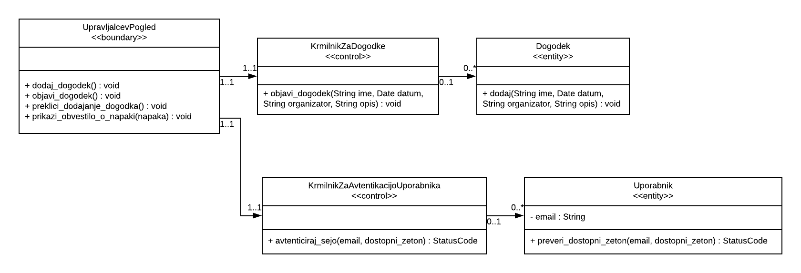

#### Razredni diagram za dodajanje vnosa v koledar (akter: registriran uporabnik, funkcionalnost: dodajanje vnosa v koledar).
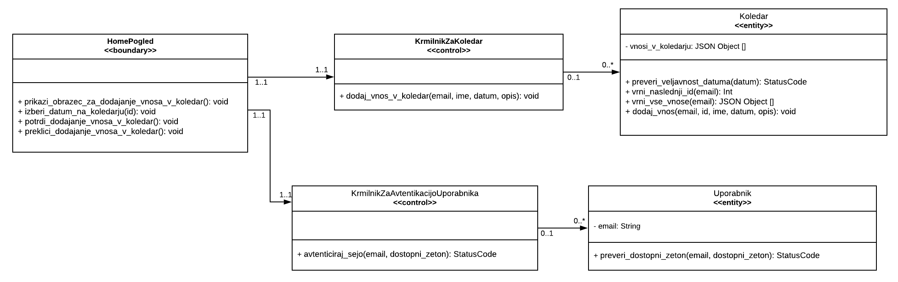

#### Razredni diagram za urejanje vnosa v koledarju (akter: registriran uporabnik, funkcionalnost: urejanje vnosa v koledarju).
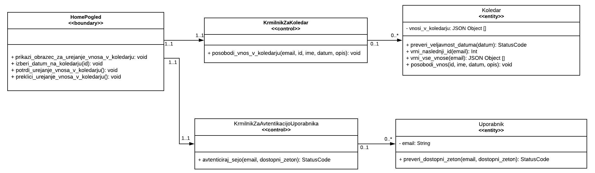

#### Razredni diagram za brisanje vnosa iz koledarja (akter: registriran uporabnik, funkcionalnost: brisanje vnosa iz koledarju).
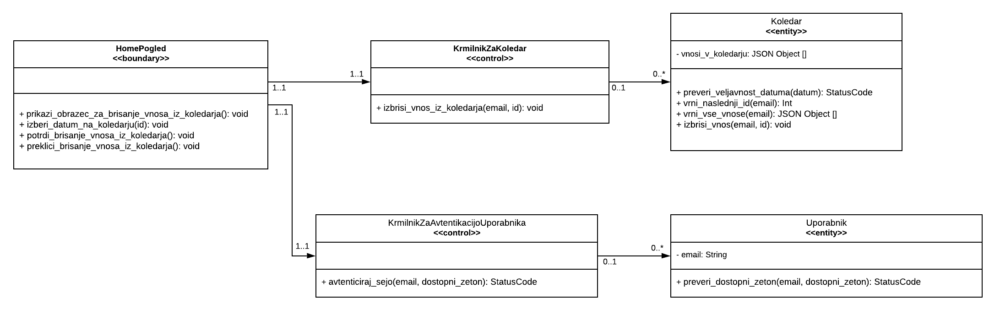

#### Razredni diagram za dodajanje vnosa v urnik (akter: registriran uporabnik, funkcionalnost: dodajanje vnosa v urnik).
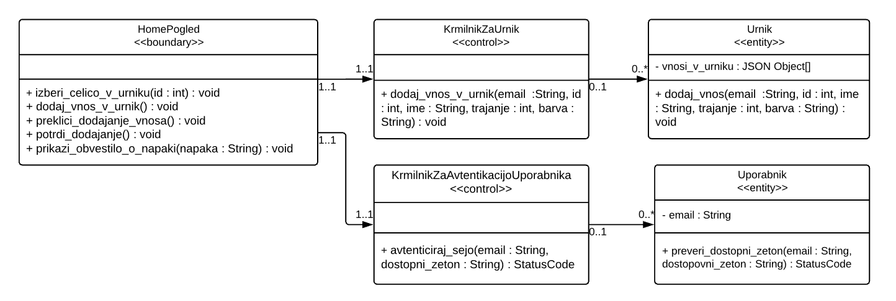

#### Razredni diagram za urejanje vnosa v urniku (akter: registriran uporabnik, funkcionalnost: urejanje vnosa v urniku).
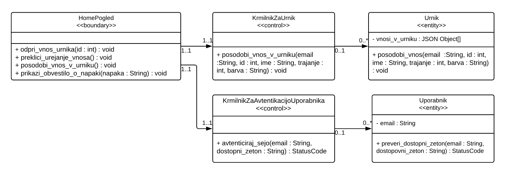

#### Razredni diagram za brisanje vnosa iz urnika (akter: registriran uporabnik, funkcionalnost: brisanje vnosa iz urnika).
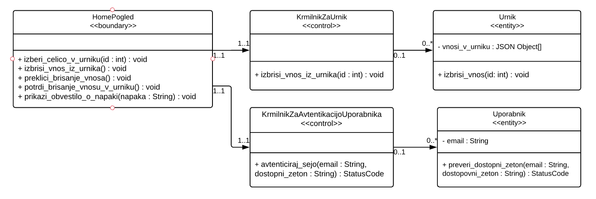

#### Razredni diagram za pregled dogodkov (akter: registriran ali neregistriran uporabnik, funkcionalnost: pregled dogodkov).
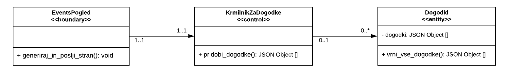

#### Razredni diagram za pregled prihodov avtobusov (akter: registriran ali neregistriran uporabnik, funkcionalnost: pregled prihodov avtobusov).
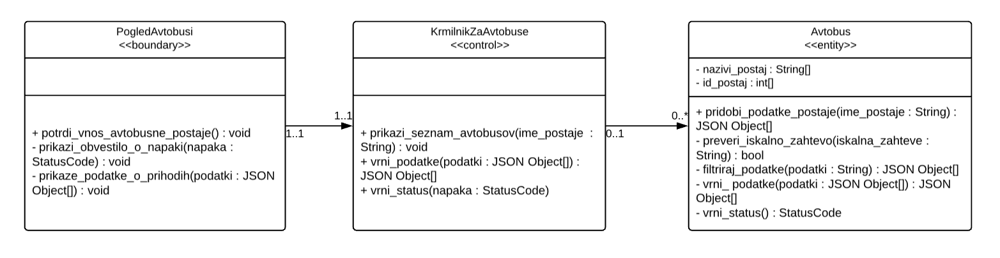

#### Razredni diagram za pošiljanje sistemskih obvestil uporabnikom (akter: administrator, funkcionalnost: pošiljanje sistemskih obvestil).


#### Razredni diagram za dodajanje TODO elementov (akter: Registriran uporabnik, funkcionalnost: Dodajanje vnosov v seznam TODO).


#### Razredni diagram za spreminjanje TODO elementov (akter: Registriran uporabnik, funkcionalnost: Spreminjanje vnosov v seznamu TODO).
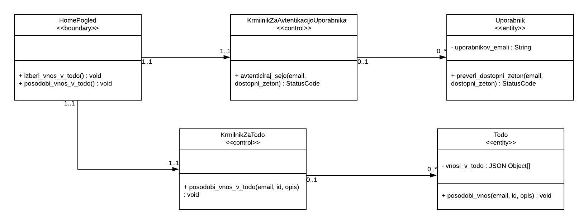

#### Razredni diagram za brisanje TODO elementov (akter: Registriran uporabnik, funkcionalnost: Brisanje vnosov iz seznama TODO).
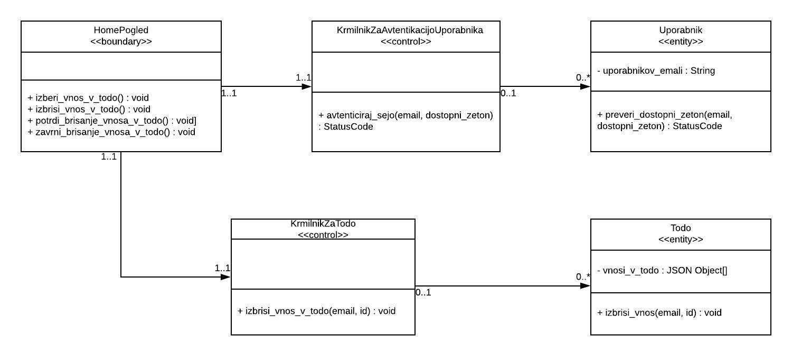

#### Razredni diagram za ogled podatkov o restavraciji (akter: Registriran uporabnik, Neregistriran uporabnik, funkcionalnost: Ogled podatkov o bližnjih restavracijah na bone).
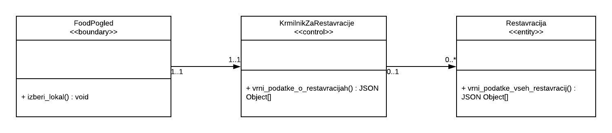


### 2.3 Opis razredov
    
---

---


#### KrmilnikZaAvtentikacijoUporabnika

Ta razred se uporablja pri registraciji, prijavi, spremembi gesla in splošni avtentikaciji. 
Pomemben je zato, da se uporabnikom omeji dostop do funkcionalnosti in delov spletne strani v obsegu njihovih pravic.
Gre za krmilnik v arhitekturnem vzorcu MVC.

#### Atributi

Ta razred ne vsebuje atributov.

#### Nesamoumevne metode

* metoda: izvedi_registracijo
    * imena in tipi parametrov
        * uporabnikov_email: String
        * geslo1: String
        * geslo2: String
    * tip rezultata: StatusCode
    * pomen: modelu posreduje ukaze za registracijo in vrne statusno kodo glede na uspeh postopka
    
* metoda: izvedi_prijavo
    * imena in tipi parametrov
        * uporabnikov_email: String
        * geslo: String
    * tip rezultata: StatusCode
    * pomen: modelu posreduje ukaze za prijavo in vrne statusno kodo glede na uspeh postopka.

* metoda: spremeni_geslo
    * imena in tipi parametrov
        * uporabnikov_email: String
        * staro_geslo: String
        * novo_geslo: String
    * tip rezultata: StatusCode
    * pomen: modelu posreduje ukaze za spremembo gesla in vrne statusno kodo glede na uspeh postopka.
    
* metoda: avtenticiraj_sejo
    * imena in tipi parametrov
        * uporabnikov_email: String
        * dostopni_zeton: String
    * tip rezultata: StatusCode
    * pomen: modelu posreduje ukaze za avtentikacijo seje in vrne statusno kodo glede na uspeh postopka.
    
---

---


#### RegistracijskiObrazec

Ta razred se uporablja pri registraciji.
Gre za pogled v arhitekturnem vzorcu MVC.

#### Atributi

Ta razred ne vsebuje atributov.

#### Nesamoumevne metode

* metoda: registriraj_se
    * metoda ne sprejme parametrov
    * tip rezultata: void
    * pomen: krmilniku posreduje vnešene podatke, da se lahko izvede postopek registracije.
    
* metoda: prikazi_obvestilo_o_napaki
    * imena in tipi parametrov
        * napaka: String
    * tip rezultata: void
    * pomen: prikaže obvestilo o napaki pri registraciji.

---

---

#### PrijavniObrazec 

Ta razred se uporablja pri prijavi.
Gre za pogled v arhitekturnem vzorcu MVC.

#### Atributi

Ta razred ne vsebuje atributov.

#### Nesamoumevne metode

* metoda: prijavi_se
    * metoda ne sprejme parametrov
    * tip rezultata: void
    * pomen: krmilniku posreduje vnešene podatke, da se lahko izvede postopek prijave.
    
* metoda: prikazi_obvestilo_o_napaki
    * imena in tipi parametrov
        * napaka: String
    * tip rezultata: void
    * pomen: prikaže obvestilo o napaki pri prijavi.

---

---

#### SpremembaGeslaObrazec  

Ta razred se uporablja pri spremembi gesla za registrirane uporabnike.
Gre za pogled v arhitekturnem vzorcu MVC.

#### Atributi

Ta razred ne vsebuje atributov.

#### Nesamoumevne metode

* metoda: spremeni_geslo
    * metoda ne sprejme parametrov
    * tip rezultata: void
    * pomen: krmilniku posreduje vnešene podatke, da se lahko izvede postopek spremembe gesla.
    
* metoda: prikazi_obvestilo_o_napaki
    * imena in tipi parametrov
        * napaka: String
    * tip rezultata: void
    * pomen: prikaže obvestilo o napaki pri spremembi gesla.

---

---

#### Uporabnik

Ta razred se uporablja pri vseh aktivnostih, kjer je na kakršenkoli način potrebno dostopati do podatkov uporabnika in jih spreminjati (npr. email, hashed geslo, dostopni žeton).
Gre za model v arhitekturnem vzorcu MVC.

#### Atributi

* email: String
* hashed_geslo: String
* dostopni_zeton: String

#### Nesamoumevne metode

* metoda: preveri_uporabnika
    * imena in tipi parametrov
        * email: String
    * tip rezultata: StatusCode
    * pomen: preverimo, ali je uporabnik že potrdil svoj račun. Prošnjo za potrditev dobi kot sporočilo na svoj email naslov.
    
* metoda: preveri_veljavnost_emaila
    * imena in tipi parametrov
        * email: String
    * tip rezultata: StatusCode
    * pomen: pri registraciji preverimo, ali je email naslov veljaven in ali je že v uporabi.

* metoda: preveri_veljavnost_gesla
    * imena in tipi parametrov
        * geslo1: String
        * geslo2: String
    * tip rezultata: StatusCode
    * pomen: pri registraciji preverimo, ali se gesli ujemata in ali želeno geslo ustreza zahtevanim pogojem.
    
* metoda: preveri_geslo
    * imena in tipi parametrov
        * email: String
        * geslo: String
    * tip rezultata: StatusCode
    * pomen: preverimo, ali je geslo pravilno glede na podani email naslov. Na strežniku se geslo pošlje skozi hash funkcijo in nato primerja z geslom v bazi.

* metoda: spremeni_geslo
    * imena in tipi parametrov
        * email: String
        * geslo: String
    * tip rezultata: void
    * pomen: spremenimo geslo, ki je povezano z podanim email naslovom.
    
* metoda: poslji_potrditveni_email
    * imena in tipi parametrov
        * email: String
    * tip rezultata: void
    * pomen: na podani email naslov pošljemo sporočilo s povezavo za potrditev računa.

* metoda: dodaj_uporabnika
    * imena in tipi parametrov
        * email: String
        * hashed_geslo: String
    * tip rezultata: void
    * pomen: podani email naslov in hashed geslo shranimo v bazo za kasnejšo prijavo.

* metoda: preveri_veljavnost_potrditvenega_zetona
    * imena in tipi parametrov
        * potrditveni_zeton: String
    * tip rezultata: StatusCode
    * pomen: pri postopku registracije preverimo, ali je potrditveni žeton že potekel.

* metoda: dodaj_uporabnika_v_seznam_nepotrjenih
    * imena in tipi parametrov
        * email: String
        * potrditveni_zeton: String
    * tip rezultata: void
    * pomen: pri postopku registracije dodamo v bazo vnos z uporabnikovim email naslovom in unikatnim potrditvenim žetonom, ki je veljaven 2 dni.

* metoda: odstrani_uporabnika_iz_seznama_nepotrjenih
    * imena in tipi parametrov
        * email: String
    * tip rezultata: void
    * pomen: pri postopku registracije iz baze odstranimo vnos o uporabnikovem email naslovu in s tem zaključim postopek registracije.

* metoda: shrani_dostopni_zeton
    * imena in tipi parametrov
        * email: String
        * cas_dostopa: Date
    * tip rezultata: void
    * pomen: Po prijavi shranimo dostopni žeton, ki bo do konca seje služil avtentikaciji uporabnika s podanim email naslovom.

* metoda: nazaj_poslji_dostopni_piskotek
    * metoda ne sprejme parametrov
    * tip rezultata: Piskotek
    * pomen: Uporabniku posljemo generiran dostopni piškotek, ki ga bo v nadaljevanju seje pošiljal strežniku in od strežnika prejemal za namene avtentikacije.

* metoda: preveri_dostopni_zeton
    * imena in tipi parametrov
        * email: String
        * dostopni_zeton: String
    * tip rezultata: StatusCode
    * pomen: Preverimo, ali je dostopni žeton za uporabnika s podanim email naslovom še vedno veljaven (drugače povedano - ali je uporabnikova seja že potekla).


---


---

#### KrmilnikZaKoledar

* Krmilnik za koledar se uporablja pri upravljanju s koledarjem in vnosi v njem. Služi za manipuliranje vnosov in pošiljanje obstoječih vnosov v Home pogled.

#### Atributi

Ta razred ne vsebuje atributov.

#### Nesamoumevne metode

* metoda: dodaj_vnos_v_koledarju
    * imena in tipi parametrov
        * email: String
        * ime: String
        * datum: Date
        * opis: String
    * tip rezultata: void
    * pomen: modelu pošlje podatke, ki jih uporabi za nov vnos v koledarju
    
* metoda: posodobi_vnos_v_koledarju
    * imena in tipi parametrov
        * email: String
        * id: int
        * novo_ime: String
        * nov_datum: Date
        * nov_opis: String
    * tip rezultata: void
    * pomen: modelu pošlje podatke, s katerimi posodobi obstoječ vnos v koledarju

* metoda: izbrisi_vnos_iz_koledarja
    * imena in tipi parametrov
        * email: String
        * id: String
    * tip rezultata: void
    * pomen: modelu pošlje podatke vnosa za izbris
    
---

---

#### KrmilnikZaUrnik

* Krmilnik za urnik se uporablja pri upravljanju z urnikom in vnosi v njem. Služi za manipuliranje vnosov in pošiljanje obstoječih vnosov v Home pogled.

#### Atributi

Ta razred ne vsebuje atributov.

#### Nesamoumevne metode

* metoda: dodaj_vnos_v_urnik
    * imena in tipi parametrov
        * email: String
        * id: int
        * ime: String
        * trajanje: int
        * barva: String
    * tip rezultata: void
    * pomen: modelu pošlje podatke, ki jih uporabi za nov vnos v urniku
    
* metoda: posodobi_vnos_v_urniku
    * imena in tipi parametrov
        * email: String
        * id: int
        * ime: String
        * trajanje: int
        * barva: String
    * tip rezultata: void
    * pomen: modelu pošlje podatke, s katerimi posodobi obstoječ vnos v urniku

* metoda: izbrisi_vnos_iz_urnika
    * imena in tipi parametrov
        * email: String
        * id: int
    * tip rezultata: void
    * pomen: modelu pošlje podatke vnosa za izbris iz urnika
    
---

---

#### KrmilnikZaTODO

Krmilnik za seznam TODO se uporablja pri upravljanju z vnosi v seznamu. Služi manipuliranju vnosov in pošiljanju obstoječih vnosov v Home pogled.
Gre za krmilnik v arhitekturnem vzorcu MVC.

#### Atributi

Ta razred ne vsebuje atributov.

#### Nesamoumevne metode

* metoda: dodaj_todo_polje
    * imena in tipi parametrov
        * email: String
    * tip rezultata: void
    * pomen: Modelu pošlje podatke, ki jih le ta uporabi za nov vnos v seznam TODO.
    
* metoda: posodobi_vnos_v_todo
    * imena in tipi parametrov
        * id: int
        * email: String
        * opis: String
    * tip rezultata: void
    * pomen: Modelu pošlje podatke, s katerimi posodobi obstoječ vnos v seznamu TODO.

* metoda: izbrisi_vnos_v_todo
    * imena in tipi parametrov
        * email: String
        * id: String
    * tip rezultata: void
    * pomen: Modelu pošlje podatke o vnosu, ki ga želimo izbrisati.
    
---

---


#### HomePogled

Ta razred se uporablja za prikaz uporabnikovega urnika, koledarja in seznamov TODO.
Gre za pogled v arhitekturnem vzorcu MVC.

#### Atributi

Ta razred ne vsebuje atributov.

#### Nesamoumevne metode

* metoda: izberi_datum_na_koledarju
    * imena in tipi parametrov
        * id: int
    * tip rezultata: void
    * pomen: krmilniku posreduje vnešene podatke, da se lahko izvede postopek registracije.
    
* metoda: prikazi_obrazec_za_dodajanje_vnosa_v_koledar
    * metoda ne sprejme parametrov
    * tip rezultata: void
    * pomen: prikaže obrazec, v katerega lahko uporabnik vnese podatke o novem vnosu
    
* metoda: prikazi_obrazec_za_brisanje_vnosa_iz_koledarja
    * metoda ne sprejme parametrov
    * tip rezultata: void
    * pomen: prikaže obrazec, kjer lahko uporabnik potrdi brisanje
    
* metoda: prikazi_obrazec_za_urejanje_vnosa_v_koledarju
    * metoda ne sprejme parametrov
    * tip rezultata: void
    * pomen: prikaže obrazec, kjer lahko uporabnik spremeni podatke o vnosu
    
* metoda: potrdi_dodajanje_vnosa_v_koledar
    * metoda ne sprejme parametrov
    * tip rezultata: void
    * pomen: uporabnik potrdi dodajanje, razred pošlje podatke na krmilnik za koledar
    
* metoda: potrdi_urejanje_vnosa_v_koledarju
    * metoda ne sprejme parametrov
    * tip rezultata: void
    * pomen: uporabnik potrdi spremembe, razred pošlje nove podatke na krmilnik za koledar
    
* metoda: preklic_dodajanja_vnosa_iz_koledar
    * metoda ne sprejme parametrov
    * tip rezultata: void
    * pomen: obrazec za dodajanje se zapre in vnos se ne shrani
    
* metoda: zavrni_urejanje_vnosa_v_koledarju
    * metoda ne sprejme parametrov
    * tip rezultata: void
    * pomen: obrazec za urejanje se zapre in vnos se ne spremeni
    
* metoda: potrdi_brisanje_vnosa_iz_koledarja
    * metoda ne sprejme parametrov
    * tip rezultata: void
    * pomen: vnos se izbriše iz koledarja
    
* metoda: preklic_brisanja_vnosa_iz_koledarja
    * metoda ne sprejme parametrov
    * tip rezultata: void
    * pomen: vnos se ne izbriše iz koledarja
    
* metoda: izberi_celico_v_urniku
    * imena in tipi parametrov
        * id: int
    * tip rezultata: void
    * pomen: uporabnik označi celico z id-jem

* metoda: dodaj_vnos_v_urnik
    * metoda ne sprejme parametrov
    * tip rezultata: void
    * pomen: uporabniku se prikaže obrazec, kamor lahko vpiše podatke o novem vnosu
    
* metoda: potrdi_dodajanje
    * metoda ne sprejme parametrov
    * tip rezultata: void
    * pomen: uporabnik potrdi dodajanje vnosa v urnik, razred pošlje podatke krmilniku za urnike
    
* metoda: preklici_dodajanje_vnosa
    * metoda ne sprejme parametrov
    * tip rezultata: void
    * pomen: obrazec za dodajanje se zapre in vnos se ne shrani
    
* metoda: izbrisi_vnos_iz_urnika
    * metoda ne sprejme parametrov
    * tip rezultata: void
    * pomen: uporabniku se prikaže obvestilo, na katerem lahko potrdi brisanje
    
* metoda: preklici_brisanje_vnosa
    * metoda ne sprejme parametrov
    * tip rezultata: void
    * pomen: obvestilo o brisanje se zapre in vnos se ne izbriše
    
* metoda: potrdi_brisanje_vnosa_v_urniku
    * metoda ne sprejme parametrov
    * tip rezultata: void
    * pomen: razred pošlje krmilniku za urnike podatke o izbrisanem vnosu
    
* metoda: odpri_vnos_urnika
    * imena in tipi parametrov
        * id: int
    * tip rezultata: void
    * pomen: uporabnik dvoklikne celico v urniku, odpre se mu obrazec za urejanje
    
* metoda: preklici_urejanje_vnosa
    * metoda ne sprejme parametrov
    * tip rezultata: void
    * pomen: obrazec za urejanje se zapre in vnos se ne spremeni
    
* metoda: posodobi_vnos_v_urniku
    * metoda ne sprejme parametrov
    * tip rezultata: void
    * pomen: uporabnik potrdi spremembe, razred jih pošlje krmilniku za urnike
    
* metoda: dodaj_seznam_todo
    * metoda ne sprejme parametrov
    * tip rezultata: void
    * pomen: uporabniku ustvari nov seznam TODO
    
* metoda: izberi_seznam_todo
    * imena in tipi parametrov
        * id: int
    * tip rezultata: void
    * pomen: uporabnik izbere seznam TODO, ki ga sedaj lahko ureja
    
* metoda: izbrisi_seznam_todo
    * metoda ne sprejme parametrov
    * tip rezultata: void
    * pomen: uporabnik izrise obstoječ seznam TODO


---

#### Koledar

Ta razred se uporablja pri manipuliranje ali prikazu vnosov koledarja.
Gre za model v arhitekturnem vzorcu MVC.

#### Atributi

* vnosi_v_koledarju : JSON Object[]

#### Nesamoumevne metode

* metoda: preveri_veljavnost_datuma
    * imena in tipi parametrov
        * datum: Date
    * tip rezultata: StatusCode
    * pomen: preverimo, ali je podan datum veljaven (se nahaja v razumnih razsežnostih)
    
* metoda: vrni_naslednji_id
    * imena in tipi parametrov
        * email: String
    * tip rezultata: int
    * pomen: vrne naslednji prosti ID za koledarske vnose
    
* metoda: vrni_vse_vnose
    * imena in tipi parametrov
        * email: String
    * tip rezultata: JSON Object[]
    * pomen: vrne vse vnose v koledarju uporabnika s podanim emailom, da jih lahko pogled prikaže

* metoda: dodaj_vnos
    * imena in tipi parametrov
        * email: String
        * id_vnosa: int
        * ime: String
        * datum: Date
        * opis: String
    * tip rezultata: void
    * pomen: doda nov vnos v koledar s podatki
    
* metoda: posodobi_vnos
    * imena in tipi parametrov
        * email: String
        * id_vnosa: int
        * novo_ime: String
        * nov_datum: Date
        * nov_opis: String
    * tip rezultata: void
    * pomen: spremeni obstoječ vnos z novimi podatki

* metoda: izbrisi_vnos
    * imena in tipi parametrov
        * email: String
        * id_vnosa: int
    * tip rezultata: void
    * pomen: izbriše obstoječ vnos iz koledarja

---

---

#### Urnik

Ta razred se uporablja pri manipuliranje ali prikazu vnosov iz urnika.
Gre za model v arhitekturnem vzorcu MVC.

#### Atributi

* vnosi_v_urniku : JSON Object[]

#### Nesamoumevne metode
    
* metoda: vrni_vse_vnose
    * imena in tipi parametrov
        * email: String
    * tip rezultata: JSON Object[]
    * pomen: vrne vse vnose v urniku uporabnika s podanim emailom, da jih lahko pogled prikaže

* metoda: dodaj_vnos
    * imena in tipi parametrov
        * email: String
        * id: int
        * ime: String
        * trajanje: int
        * barva: String
    * tip rezultata: void
    * pomen: doda nov vnos v urnik s podatki
    
* metoda: posodobi_vnos
    * imena in tipi parametrov
        * email: String
        * id: int
        * ime: String
        * trajanje: int
        * barva: String
    * tip rezultata: void
    * pomen: spremeni obstoječ vnos z novimi podatki

* metoda: izbris_vnosa
    * imena in tipi parametrov
        * email: String
        * id_vnosa: int
    * tip rezultata: void
    * pomen: izbriše obstoječ vnos iz urnika

---

---

#### TODO

Ta razred se uporablja pri manipuliranju in prikazu seznamov TODO.
Gre za model v arhitekturnem vzorcu MVC.

#### Atributi

* vnosi_v_TODO : JSON Object[]

#### Nesamoumevne metode
    
* metoda: vrni_vnose
    * imena in tipi parametrov
        * email: String
    * tip rezultata: JSON Object[]
    * pomen: Vrne vse TODO vnose uporabnika.

* metoda: ustvari_vnos
    * imena in tipi parametrov
        * email: String
    * tip rezultata: void
    * pomen: Ustvari nov prazen TODO vnos.
    
* metoda: posodobi_vnos
    * imena in tipi parametrov
        * email: String
        * id: int
        * opis: String
    * tip rezultata: void
    * pomen: Spremeni obstoječ vnos z novimi podatki.

* metoda: izbrisi_vnos
    * imena in tipi parametrov
        * email: String
        * id: int
    * tip rezultata: void
    * pomen: Izbriše obstoječ vnos.

---

---

#### KrmilnikZaDogodke

Krmilnik za dogodke se uporablja za dodajanje študentskih dogodkov (upravljalec z dogodki) in za pregled teh dogodkov(uporabniki)
Gre za krmilnik v arhitekturnem vzorcu MVC.

#### Atributi

Ta razred ne vsebuje atributov.

#### Nesamoumevne metode

* metoda: objavi_dogodek
    * imena in tipi parametrov
        * ime: String
        * datum: Date
        * organizator: String
        * opis: String
    * tip rezultata: void
    * pomen: modelu posreduje podatke za ustvarjanje novega dogodka
    
---

---

#### UpravljalcevPogled 

Ta razred se uporablja za dodajanje študentskih dogodkov.
Gre za pogled v arhitekturnem vzorcu MVC.

#### Atributi

Ta razred ne vsebuje atributov.

#### Nesamoumevne metode

* metoda: dodaj_dogodek
    * metoda ne sprejme parametrov
    * tip rezultata: void
    * pomen: odpre obrazec, kamor upravljalec lahko vnese podatke
    
* metoda: objavi_dogodek
    * metoda ne sprejme parametrov
    * tip rezultata: void
    * pomen: upravljalec potrdi ustvarjanje dogodka, razred krmilniku posreduje vnešene podatke, da se lahko ustvari nov dogodek.
    
* metoda: preklici_dodajanje_dogodka
    * metoda ne sprejme parametrov
    * tip rezultata: void
    * pomen: obrazec za ustvarjanje dogodka se zapre in dogodek se ne shrani
    
* metoda: prikazi_obvestilo_o_napaki
    * imena in tipi parametrov
        * napaka: String
    * tip rezultata: void
    * pomen: prikaže obvestilo o napaki pri ustvarjanju dogodka.

---

---

#### Dogodek

Ta razred se uporablja za dodajanje in branje študentskih dogodkov.
Gre za model v arhitekturnem vzorcu MVC.

#### Atributi

* dogodki : JSON Object[]

#### Nesamoumevne metode
    
* metoda: vrni_dogodke
    * imena in tipi parametrov
        * email: String
    * tip rezultata: JSON Object[]
    * pomen: vrne vse trenutne dogodke za prikaz uporabniku

* metoda: dodaj
    * imena in tipi parametrov
        * ime: String
        * datum: Date
        * organizator: String
        * opis: String
    * tip rezultata: void
    * pomen: ustvari nov študentski dogodek s podatki

---

---

#### KrmilnikZaObvestila

Krmilnik za obvestila se uporablja za pošiljanje sistemskih sporočil uporabnikom aplikacije.
Gre za krmilnik v arhitekturnem vzorcu MVC.

#### Atributi

Ta razred ne vsebuje atributov.

#### Nesamoumevne metode

* metoda: poslji_sporocilo
    * imena in tipi parametrov
        * sporocilo: String
    * tip rezultata: void
    * pomen: Modelu posreduje podatke za ustvarjanje novega sistemskega sporočila.
    
---

---

#### AdminPogled 

Ta razred se uporablja za pošiljanje novih sistemskih sporočil.
Gre za pogled v arhitekturnem vzorcu MVC.

#### Atributi

Ta razred ne vsebuje atributov.

#### Nesamoumevne metode

* metoda: novo_sporocilo
    * metoda ne sprejme parametrov
    * tip rezultata: void
    * pomen: Odpre obrazec, kamor administrator lahko vnese sistemsko sporočilo.
    
* metoda: poslji_sporocilo
    * metoda ne sprejme parametrov
    * tip rezultata: void
    * pomen: Administrator potrdi pošiljanje sistemskega sporočila, razred krmilniku posreduje vnešeno sporočilo, da se lahko le to posreduje uporabnikom.
    
* metoda: preklici_posiljanje_sporocila
    * metoda ne sprejme parametrov
    * tip rezultata: void
    * pomen: Obrazec za pošiljanje sporočila se zapre. Vpisano sporočilo se ne shrani.
    
* metoda: prikazi_obvestilo_o_napaki
    * imena in tipi parametrov
        * napaka: String
    * tip rezultata: void
    * pomen: Prikaže obvestilo o napaki pri pošiljanju sporočila.

---

---

#### AdministratorskaObvestila

Ta razred se uporablja za dodajanje novih sistemskih sporočil.
Gre za model v arhitekturnem vzorcu MVC.

#### Atributi

* obvestila : JSON Object[]

#### Nesamoumevne metode
    
* metoda: dodaj_obvestilo
    * imena in tipi parametrov
        * sporocilo: String
    * tip rezultata: void
    * pomen: Model ustvari novo sistemsko sporočilo glede na podatke, ki jih je prejel od krmilnika.

---

---

#### KrmilnikZaAvtobuse

Krmilnik za avtobuse se uporablja za izbiranje avtobusnih postaj in pregled podatkov o prihodih avtobusov na le te
Gre za krmilnik v arhitekturnem vzorcu MVC.

#### Atributi

Ta razred ne vsebuje atributov.

#### Nesamoumevne metode

* metoda: prikazi_seznam_avtobusov
    * imena in tipi parametrov
        * ime_postaje: String
    * tip rezultata: void
    * pomen:  Sporoči modelu, naj pridobi podatke s pomočjo zunanjega vmesnika.
* metoda: vrni_podatke
    * imena in tipi parametrov
        * podatki: JSON Object[]
    * tip rezultata: JSON Object[]
    * pomen: Pogledu posreduje podatke o prihodih avtobusov na avtobusno postajo.
* metoda: vrni_status
    * metoda ne sprejme parametrov
    * tip rezultata: void
    * pomen: Pogledu vrne napako za prikaz uporabniku.
    
---

---

#### Avtobus

Ta razred se uporablja za branje podatkov o prihodu avtobusov.
Gre za model v arhitekturnem vzorcu MVC.

#### Atributi

* nazivi_postaj : String[]
* id_postaj : int[]

#### Nesamoumevne metode
    
* metoda: pridobi_podatke_postaje
    * imena in tipi parametrov
        * ime_postaje: String
    * tip rezultata: JSON Object[]
    * pomen: S pomočjo zunanjega vmesnika pridobi podatke o prihodu avtobusov na postajo.

* metoda: preveri_iskalno_zahtevo
    * imena in tipi parametrov
        * iskalna_zahteva: String
    * tip rezultata: bool
    * pomen: Vrne logično vrednost glede na pravilnost imena avtobusne postaje iskalne zahteve.
    
* metoda: filtriraj_podatke
    * imena in tipi parametrov
        * podatki: String
    * tip rezultata: JSON Object[]
    * pomen: Filtrira podatke po navodilih iskalne zahteve.
    
* metoda: vrni_podatke
    * imena in tipi parametrov
        * podatki: JSON Object[]
    * tip rezultata: JSON Object[]
    * pomen: Vrne podatke o prihodu avtobusov za prikaz uporabniku.

* metoda: vrni_status
    * metoda ne sprejme parametrov
    * tip rezultata: StatusCode
    * pomen: Krmilniku vrne napako v primeru nepravilne iskalne zahteve.
---

---

#### KrmilnikZaRestavracijePriOdjemalcu

Ta razred se uporablja za prikaz bližnjih restavracij.
Gre za pogled v arhitekturnem vzorcu MVC.

#### Atributi

Ta razred ne vsebuje atributov.

#### Nesamoumevne metode

* metoda: zahtevaj_podatke_o_restavracijah
    * metoda ne sprejme parametrov
    * tip rezultata: JSON object[]
    * pomen: Pridobi podatke o lokaciji in ceni hrane bližnjih restavracij.

* metoda: prikazi_prosnjo_za_uporabo_lokacije
    * metoda ne sprejme parametrov
    * tip rezultata: void
    * pomen: Prikaži okno z zahtevo po uporabi uporabnikove lokacije.

* metoda: potrdi_uporabo_lokacije
    * metoda ne sprejme parametrov
    * tip rezultata: void
    * pomen: Uporabnik dovoli uporabo svoje lokacije.

* metoda: zavrni_uporabo_lokacije
    * metoda ne sprejme parametrov
    * tip rezultata: void
    * pomen: Uporabnik ne dovoli uporabe svoje lokacije.
    
---

---

#### KrmilnikZaRestavracije

Ta razred se uporablja za pridobitev podatkov o restavracijah.
Gre za pogled v arhitekturnem vzorcu MVC.

#### Atributi

Ta razred ne vsebuje atributov.

#### Nesamoumevne metode

* metoda: vrni_podatke_o_restavracijah
    * metoda ne sprejme parametrov
    * tip rezultata: JSON object[]
    * pomen: Pridobi podatke o lokaciji in ceni hrane restavracij.
    
---

---

#### Restavracija

Ta razred se uporablja za pridobitev podatkov o vseh restavracijah.
Gre za pogled v arhitekturnem vzorcu MVC.

#### Atributi

Ta razred ne vsebuje atributov.

#### Nesamoumevne metode

* metoda: vrni_podatke_vseh_restavracij
    * metoda ne sprejme parametrov
    * tip rezultata: JSON object[]
    * pomen: Pridobi podatke o lokaciji in ceni hrane restavracij.
    
---

---
#### FoodPogled

Ta razred se uporablja za prikaz lokacije in podatkov o restavracijah.
Gre za pogled v arhitekturnem vzorcu MVC.

#### Atributi

Ta razred ne vsebuje atributov.

#### Nesamoumevne metode

* metoda: izberi_lokal
    * metoda ne sprejme parametrov
    * tip rezultata: void
    * pomen: Prikaže lokacijo in podatke o izbrani restavraciji.
    
---

---

#### BusPogled

Ta razred se uporablja za prikaz lokacije in podatkov o avtobusih.
Gre za pogled v arhitekturnem vzorcu MVC.

#### Atributi

Ta razred ne vsebuje atributov.

#### Nesamoumevne metode

* metoda: potrdi_vnos_avtobusne_postaje
    * metoda ne sprejme parametrov
    * tip rezultata: void
    * pomen: Potrdi uporabnikovo izbiro avtobusne postaje.
    
* metoda: prikazi_obvestilo_o_napaki
    * imena in tipi parametrov
        * napaka: StatusCode
    * tip rezultata: void
    * pomen: Prikaže sporocilo o napaki.
    
* metoda: prikazi_podatke_o prihodih
    * imena in tipi parametrov
        * podatki: JSON object[]
    * tip rezultata: void
    * pomen: Prikaže podatke o prihodih na postajo.
    
---

---

#### EventsPogled

Ta razred se uporablja za prikaz prihajajočih dogodkov.
Gre za pogled v arhitekturnem vzorcu MVC.

#### Atributi

Ta razred ne vsebuje atributov.

#### Nesamoumevne metode

* metoda: generiraj_in_poslji_stran
    * metoda ne sprejme parametrov
    * tip rezultata: void
    * pomen: Prikaže podatke o prihajajočih dogodkih.
    
---

---


## 3. Načrt obnašanja

V tem razdelku je z diagrami zaporedja predstavljeno podrobno obnašanje sistema.

#### Diagram zaporedja za registracijo (akter: neregistriran uporabnik, funkcionalnost: registracija).
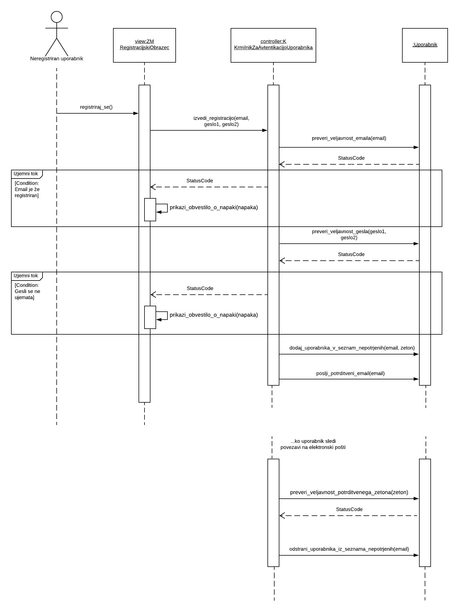

#### Diagram zaporedja za prijavo (akter: registriran uporabnik, administrator ali upravljalec dogodkov, funkcionalnost: prijava).
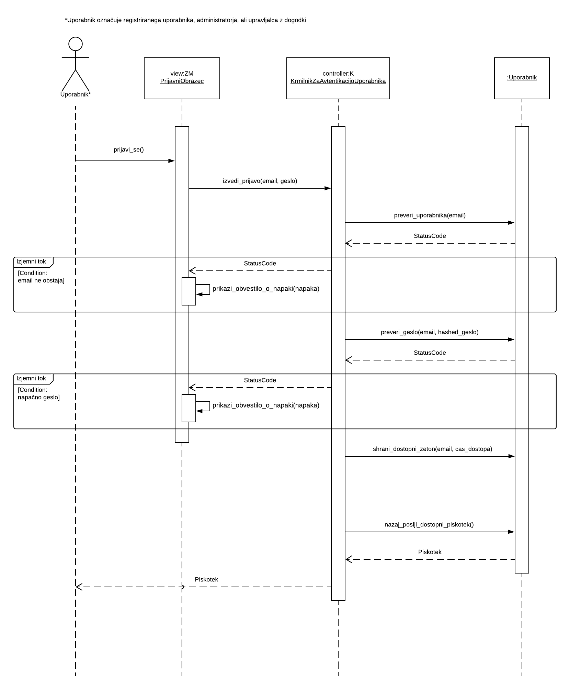

#### Diagram zaporedja za spremembo gesla (akter: registriran uporabnik, funkcionalnost: sprememba gesla).
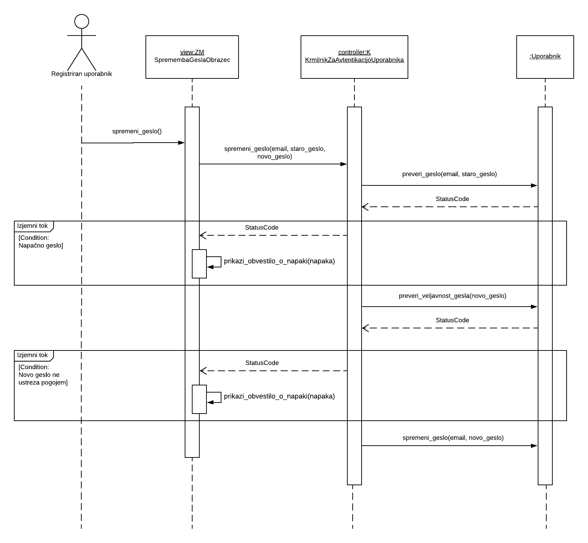

#### Diagram zaporedja za objavljanje dogodkov (akter: upravljalec z dogodki, funkcionalnost: objavljanje dogodkov).
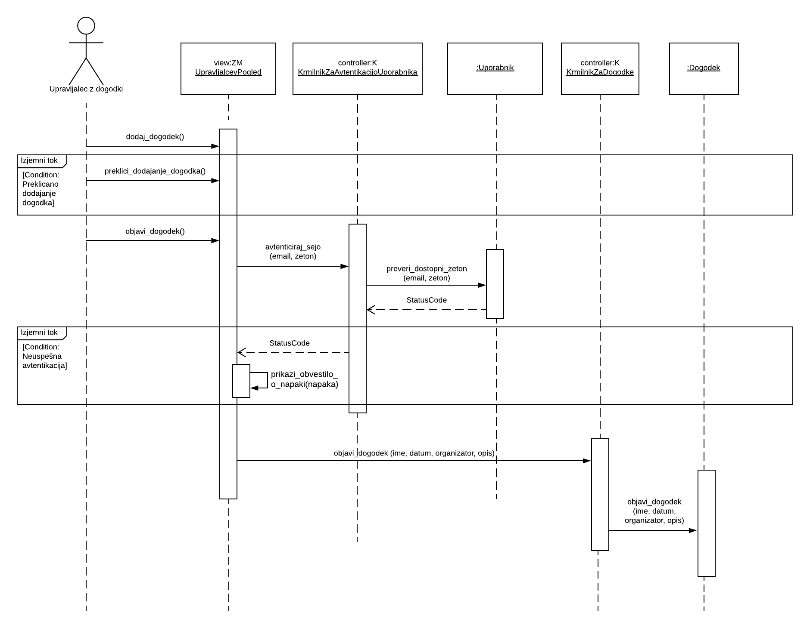

#### Diagram zaporedja za dodajanje vnosa v koledar (akter: registriran uporabnik, funkcionalnost: dodajanje vnosa v koledar).
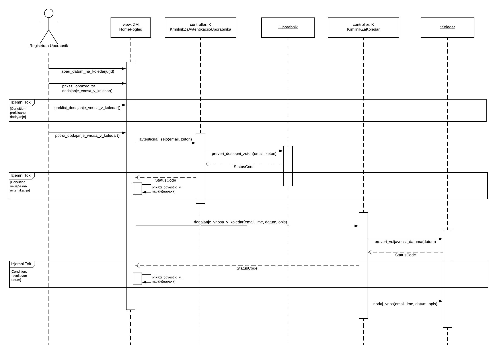

#### Diagram zaporedja za urejanje vnosa v koledarju (akter: registriran uporabnik, funkcionalnost: urejanje vnosa v koledarju).
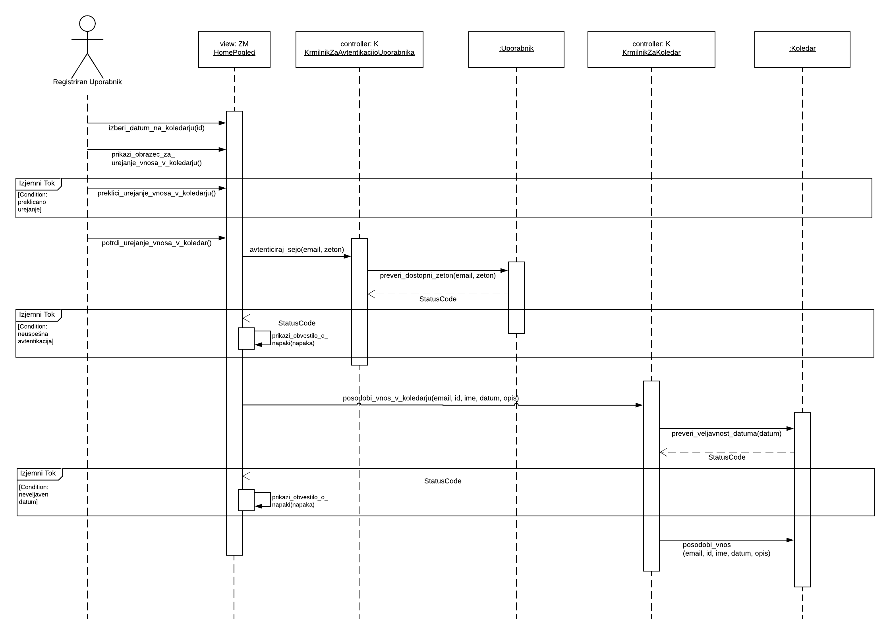

#### Diagram zaporedja za brisanje vnosa iz koledarja (akter: registriran uporabnik, funkcionalnost: brisanje vnosa iz koledarju).
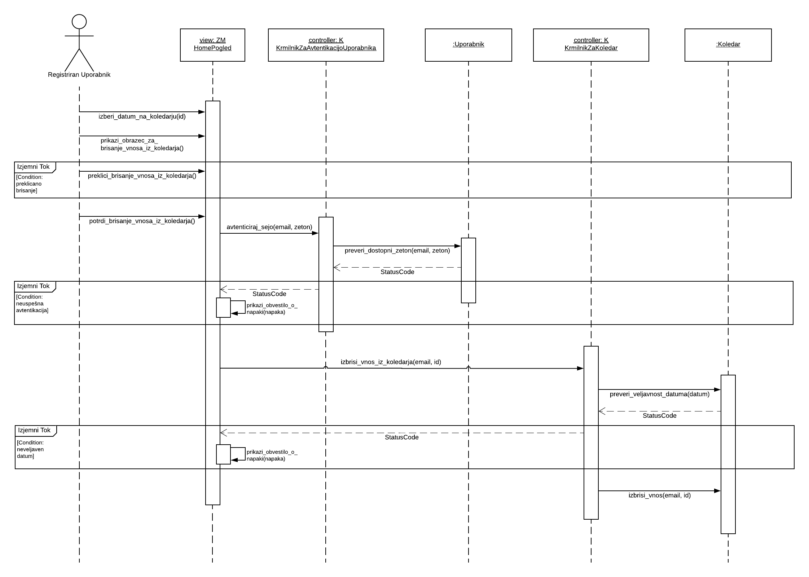

#### Diagram zaporedja za dodajanje vnosa v urnik (akter: registriran uporabnik, funkcionalnost: dodajanje vnosa v urnik).
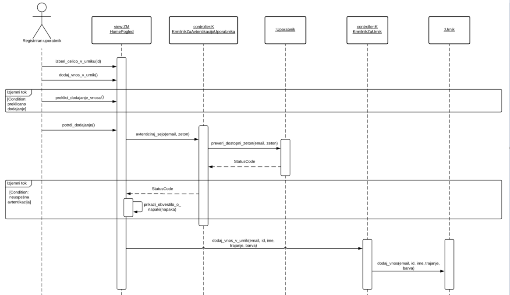

#### Diagram zaporedja za urejanje vnosa v urniku (akter: registriran uporabnik, funkcionalnost: urejanje vnosa v urniku).
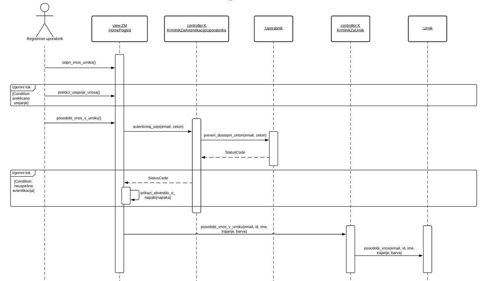

#### Diagram zaporedja za brisanje vnosa iz urnika (akter: registriran uporabnik, funkcionalnost: brisanje vnosa iz urnika).
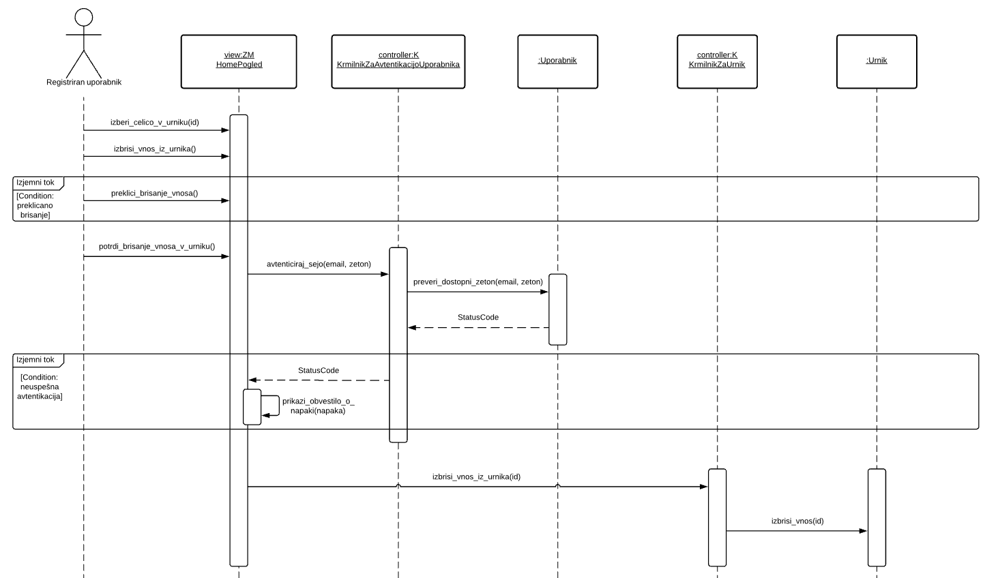

#### Diagram zaporedja za pregled prihodov avtobusov (akter: registriran ali neregistriran uporabnik, funkcionalnost: pregled prihodov avtobusov).
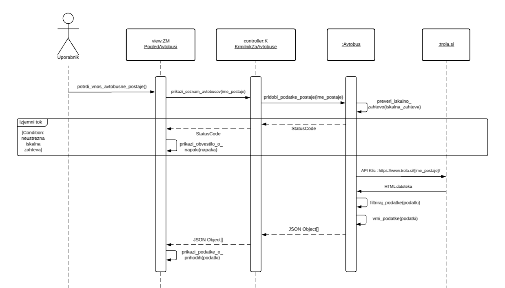

#### Diagram zaporedja za pošiljanje sistemskih obvestil uporabnikom (akter: administrator, funkcionalnost: pošiljanje sistemskih obvestil).
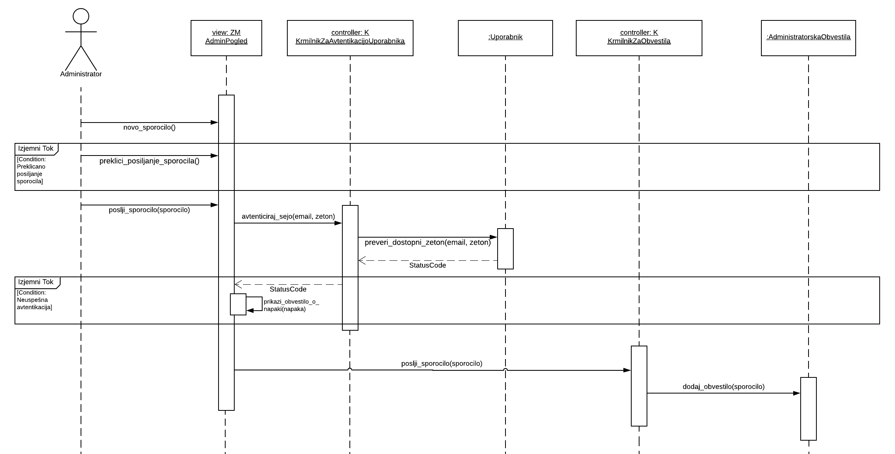

#### Diagram zaporedja za dodajanje TODO elementov (akter: Registriran uporabnik, funkcionalnost: Dodajanje vnosov v seznam TODO).
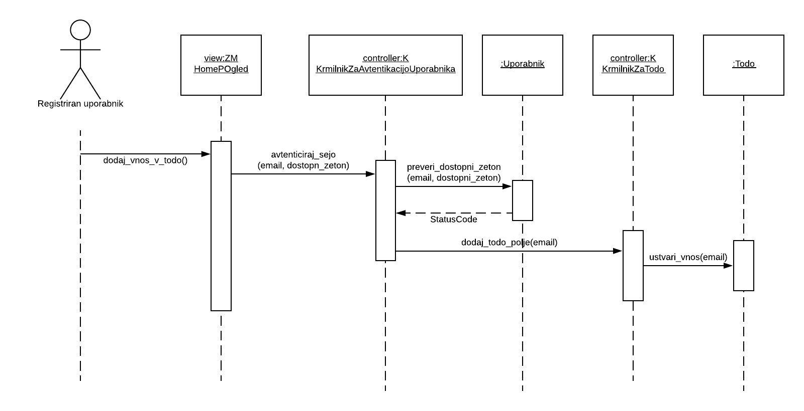

#### Diagram zaporedja za spreminjanje TODO elementov (akter: Registriran uporabnik, funkcionalnost: Spreminjanje vnosov v seznamu TODO).
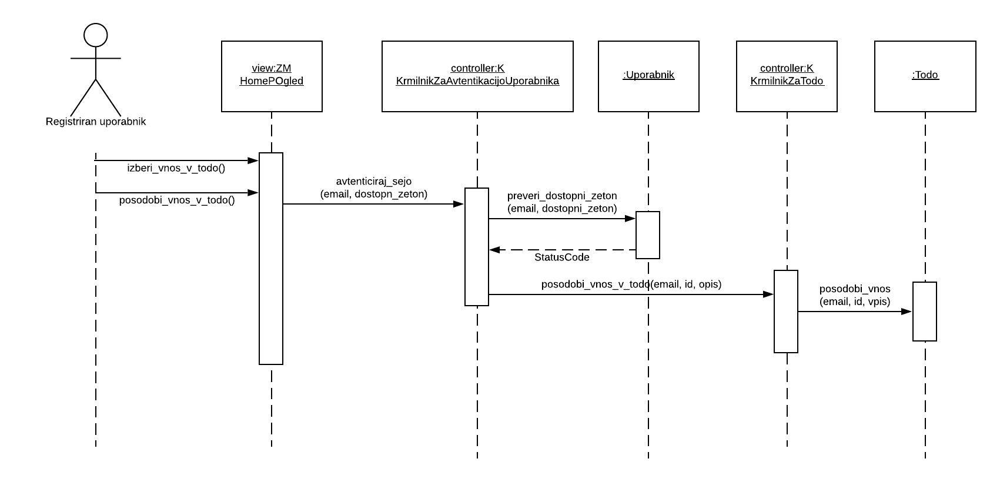

#### Diagram zaporedja za brisanje TODO elemntov (akter: Registriran uporabnik, funkcionalnost: Brisanje vnosov iz seznama TODO).
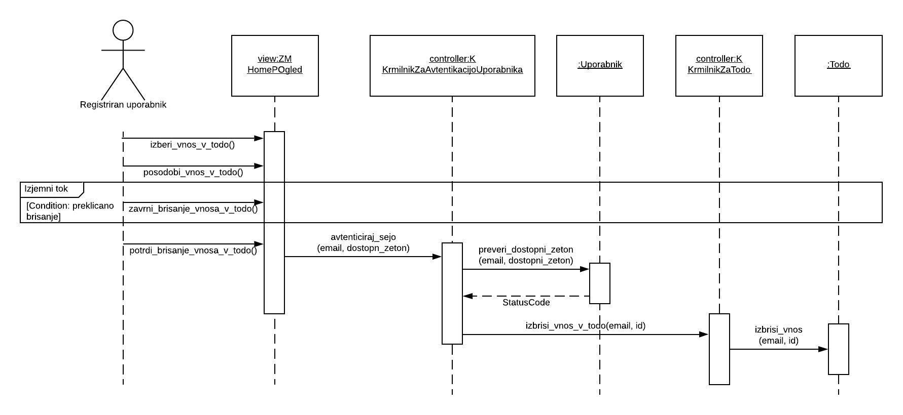

#### Diagram zaporedja za ogled podatkov o restavraciji (akter: Neregistriran ali registriran uporabnik, funkcionalnost: Ogled podatkov o bližnjih restavracijah na bone).
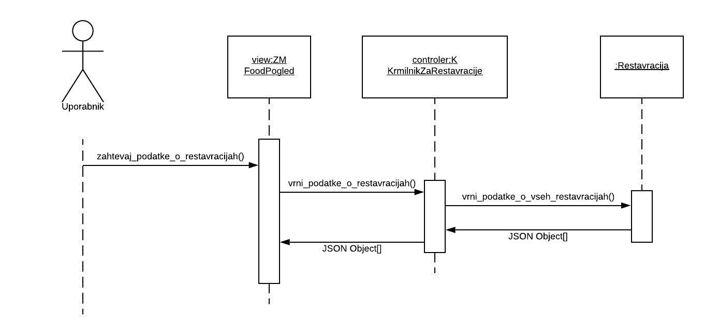

#### Psevdokoda za pregled dogodkov (akter: Neregistriran uporabnik, Registriran uporabnik, funkcionalnost: Pregled dogodkov).
```
class EventsPogled {

   ...

   void generiraj_in_poslji_stran() {

       JSON[] dogodki = KrmilnikZaDogodke.pridobi_dogodke();

       String html_stran = "";

       html_stran += get_html_head();

       for (dogodek: dogodki) {

           html_stran += generate_event_html_snippet(dogodek);

       }

       html_stran += get_html_tail();

       send_to_user(user_connection, html_stran);

   }

}
```