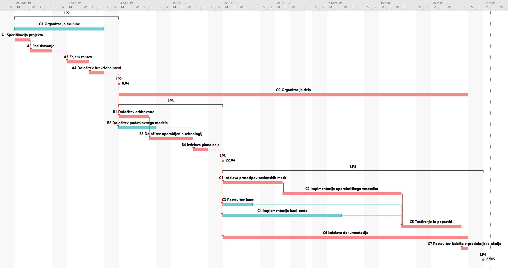
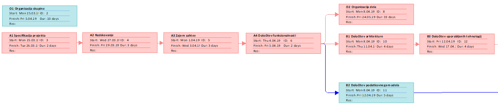
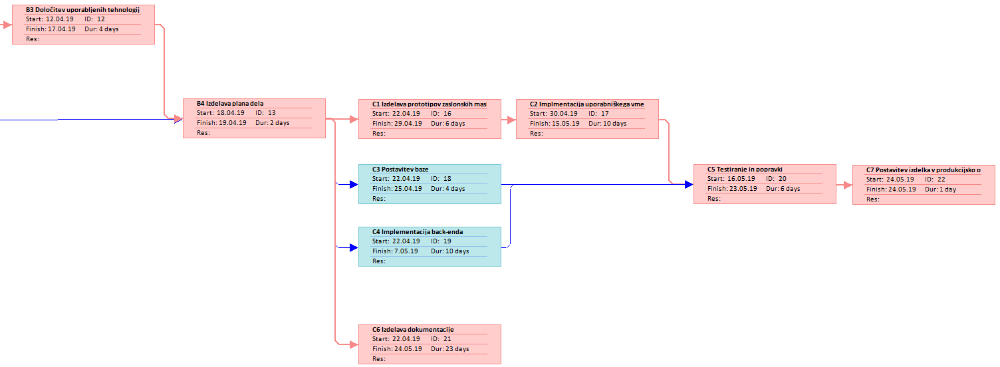
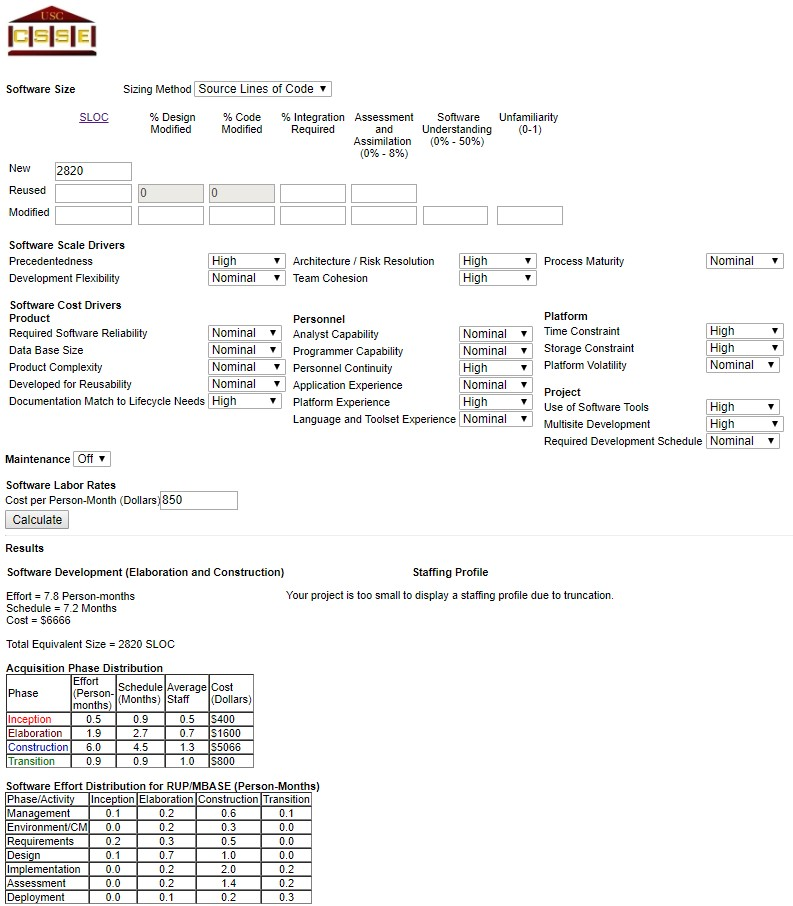

# Predlog projekta
|                             |                                                               |
|:----------------------------|:--------------------------------------------------------------|
| **Naziv projekta**          | StraightAs                                                    |
| **Člani projektne skupine** | Žan Horvat, Filip Grčar, Anže Gorjan Novak in Gašper Vrhovnik |
| **Kraj in datum**           | Kamnik, 10.3.2019                                             |

## Povzetek projekta

Veliko študentov se sooča s stresom in problemom težke glave, saj si morajo zapomniti veliko rokov za oddajo in izpitnih rokov, datume kolokvijev in vseh ostalih sprotnih obveznosti, ki spadajo k uspešnemu opravljanju študija. Naš cilj je, da jih razbremenimo, tako da jim razvijemo spletno aplikacijo za pomoč pri opravljanju njihovih študijskih obveznosti. Spletni vmesnik bo omogočal jasen pregled nad vsemi obveznostmi kot so predavanja, vaje, domače naloge in izpiti, torej vse pomembne zadeve zbrane na enem mestu, uporabnik pa si bo lahko določil tudi prioritete aktivnosti ter tako dobil boljši načrt dela za naslednje dni. Ob uporabi aplikacije se bo tako študent organizirano in učinkovito spopadal z vsemi študijskimi obveznostmi.

## 1. Motivacija

Imeti seznam dnevnih obveznosti zmeraj pri roki in vedno na voljo vodi v lažje opravljanje le teh. Aplikacija, ki pokriva vse bistvene aktivnosti študija, študenta prav tako reši pred nelagodnim občutkom, da je nekaj pozabil opraviti. Čeprav podobne aplikacije že poznamo, pa se naša rešitev razlikuje od drugih s tem, da je bolj specifično usmerjena, saj je v prvi vrsti namenjena študentom v Sloveniji, poleg tega bo sama aplikacija ustvarjena s strani študentov za študente. Uporaba naše aplikacije bo preprosta, v njej pa bodo zbrane vse pomembne naloge uporabnika na enem mestu ne glede na vrsto naprave. Študentom bomo tako omogočili mirnejši spanec, saj bodo vedeli, da pred vsemi današnjimi obveznostmi že stoji kljukica, za jutri pa že imajo pripravljen "TO-DO list", ki čaka, da bo obkljukan.

## 2. Cilji projekta in pričakovani rezultati

Aplikacija StraightAs bo oblikovana kot spletni vmesnik, kjer bo uporabnik lahko hranil vse pomembne stvari, ki so povezane s študijem, torej urnik ter različne obveznosti kot so oddaje domačih nalog, datumi kolokvijev in izpitov ter vnašanje ocen. Obveznosti bo mogoče dodajati, odstranjevati, jim dodajati prioritete, opise in seveda roke do zapadlosti. Uporabnik bo tako lahko pridobil "TO-DO liste" oz. seznam vseh obveznosti za posamezen dan, lahko pa tudi na tedenski ali mesečni ravni ter samo obveznosti nekega tipa ali vse skupaj. Uporabniku bo aplikacija dosegljiva na spletu in prilagojena za vse vrste naprav, naš cilj pa je, da bi študent pred začetkom dela obiskal našo aplikacijo, ki mu bo ponudila današnje obveznosti urejene po prioriteti in bo lahko takoj začel z delom. Aplikacija bo zgrajena po MVC arhitekturi ter z uporabo MEAN sklada tehnologij.

### 2.1 Opis ciljev

* Omogočiti študentu sledenje svojim obveznostim na enem mestu na različnih napravah
* Predlagati uporabniku načrt dela, glede na roke zapadlosti in stopnjo prioritete obveznosti
* Pomagati študentu pri večji organiziranosti in učinkovitosti pri delu
* Študentu zmanjšati raven stresa zaradi vsakodnevnih obveznosti

### 2.2 Pričakovani rezultati

* Spletna aplikacija, ki uporabnikom omogoča sledenje svojim obveznostim vedno in povsod
* Aplikacija, ki uporabniku predlaga možen plan dela
* Študent, ki je z uporabo naše aplikacije sproščen in učinkovit pri svojem delu

## 3. Projektni načrt

### 3.1 Povzetek razdelitve projekta na aktivnosti

Projekt je razdeljen na 17 aktivnosti, ki sodijo v 4 sklope (A, B, C in O). 

V sklop O spadajo aktivnosti, ki zajemajo organizacijo projekta. Na začetku organizacija skupine nato pa reden pregled in organizacija dela glede na dosežene cilje. 

Sklopa A in B zajemata aktivnosti pred programiranjem. Sklop A fazo aktivnosti v katerih se zbira zahteva, določi specifikacije projekta, razišče področje organizacije študijskih obveznosti in poišče morebitne podobne projekte. Sklop B se osredotoča na primerne tehnologije glede na problemsko domeno in znanje ekipe, ki bo delala na projektu. Sklop B pokriva tudi načrtovanje arhitekture projekta in podatkovni model.

V sklopu C pa so zajete aktivnosti, ki predstavljajo razvoj spletne aplikacije: zaledni sistem s podatkovno bazo, uporabniški vmesnik. V razvoj so vključene tudi aktivnosti, ki skrbijo za kvaliteto rešitve: testiranje, dokumentiranje. Zadnja aktivnost v tem sklopu pa predstavlja implementacijo rešitve v produkcijsko okolje.

### 3.2 Načrt posameznih aktivnosti

| **Oznaka aktivnosti**                               | O1                                                                                                                                                    |
|:----------------------------------------------------|:------------------------------------------------------------------------------------------------------------------------------------------------------|
| **Predvideni datum pričetka izvajanja aktivnosti**  | 25.3.2019                                                                                                                                             |
| **Predvideni datum zaključka izvajanja aktivnosti** | 5.4.2019                                                                                                                                              |
| **Trajanje**                                        | 10 dni                                                                                                                                                |
| **Naziv aktivnosti**                                | Organizacija skupine                                                                                                                                  |
| **Obseg aktivnosti v ČM**                           | 0,30                                                                                                                                                  |
| **Seznam ciljev aktivnosti (kaj želite doseči)**    | Določitev vodje, razporeditev grobih področij dela za člane, vzpostaviti kanal komunikacije                                                           |
| **Opis aktivnosti**                                 | Člani ekipe določijo vodjo z glasovanjem, si določijo groba področja dela v katera se bodo usmerili in vzpostavijo kanal komunikacije, ki jim ustreza |
| **Morebitne odvisnosti in omejitve**                | /                                                                                                                                                     |
| **Pričakovani rezultati aktivnosti**                | Vodja, področja dela razdeljena med člani, komunikacijski kanal                                                                                       |

| **Oznaka aktivnosti**                               | A1                                                                           |
|:----------------------------------------------------|:-----------------------------------------------------------------------------|
| **Predvideni datum pričetka izvajanja aktivnosti**  | 25.3.2019                                                                    |
| **Predvideni datum zaključka izvajanja aktivnosti** | 26.3.2019                                                                    |
| **Trajanje**                                        | 2 dni                                                                        |
| **Naziv aktivnosti**                                | Specifikacija projekta                                                       |
| **Obseg aktivnosti v ČM**                           | 0,35                                                                         |
| **Seznam ciljev aktivnosti (kaj želite doseči)**    | Koncepti končne rešitve                                                      |
| **Opis aktivnosti**                                 | Člani skupine oblikujejo koncepte končne rešitve, postavijo temelje projekta |
| **Morebitne odvisnosti in omejitve**                | To je prva aktivnost, je na kritični poti                                    |
| **Pričakovani rezultati aktivnosti**                | Koncepti in temelji projekta                                                 |

| **Oznaka aktivnosti**                               | A2                                                                                                                                    |
|:----------------------------------------------------|:--------------------------------------------------------------------------------------------------------------------------------------|
| **Predvideni datum pričetka izvajanja aktivnosti**  | 27.3.2019                                                                                                                             |
| **Predvideni datum zaključka izvajanja aktivnosti** | 29.3.2019                                                                                                                             |
| **Trajanje**                                        | 3 dni                                                                                                                                 |
| **Naziv aktivnosti**                                | Raziskovanje                                                                                                                          |
| **Obseg aktivnosti v ČM**                           | 0,45                                                                                                                                  |
| **Seznam ciljev aktivnosti (kaj želite doseči)**    | Raziskava že obstoječih produktov, možnih izbir tehnologij in arhitektur projekta                                                     |
| **Opis aktivnosti**                                 | Člani raziskujejo obstoječe projekte, razmišljajo o možnih problemih. Naredijo hiter pregled možnih arhitektur in tehnologij projekta |
| **Morebitne odvisnosti in omejitve**                | Aktivnost je na kritični poti in sledi aktivnosti A1                                                                                  |
| **Pričakovani rezultati aktivnosti**                | Razumevanje kje so prednosti in slabosti obstoječih projektov, tehnologij in arhitektur                                               |

| **Oznaka aktivnosti**                               | A3                                                                             |
|:----------------------------------------------------|:-------------------------------------------------------------------------------|
| **Predvideni datum pričetka izvajanja aktivnosti**  | 1.4.2019                                                                       |
| **Predvideni datum zaključka izvajanja aktivnosti** | 3.4.2019                                                                       |
| **Trajanje**                                        | 3 dni                                                                          |
| **Naziv aktivnosti**                                | Zajem zahtev                                                                   |
| **Obseg aktivnosti v ČM**                           | 0,50                                                                           |
| **Seznam ciljev aktivnosti (kaj želite doseči)**    | Seznam zahtev projekta                                                         |
| **Opis aktivnosti**                                 | Člani ekipe določijo zahteve projekta glede na raziskavo v prejšnji aktivnosti |
| **Morebitne odvisnosti in omejitve**                | Aktivnost je na kritični poti in sledi aktivnosti A2                           |
| **Pričakovani rezultati aktivnosti**                | Seznam zahtev                                                                  |

| **Oznaka aktivnosti**                               | A4                                                                      |
|:----------------------------------------------------|:------------------------------------------------------------------------|
| **Predvideni datum pričetka izvajanja aktivnosti**  | 4.4.2019                                                                |
| **Predvideni datum zaključka izvajanja aktivnosti** | 6.4.2019                                                                |
| **Trajanje**                                        | 2 dni                                                                   |
| **Naziv aktivnosti**                                | Določitev funkcionalnosti                                               |
| **Obseg aktivnosti v ČM**                           | 0,40                                                                    |
| **Seznam ciljev aktivnosti (kaj želite doseči)**    | Določitev funkcionalnosti                                               |
| **Opis aktivnosti**                                 | Člani ekipe določijo potrebne funkcionalnosti na podlagi seznama zahtev |
| **Morebitne odvisnosti in omejitve**                | Aktivnost je na kritični poti in sledi aktivnosti A3                    |
| **Pričakovani rezultati aktivnosti**                | Seznam funkcionalnosti                                                  |

| **Oznaka aktivnosti**                               | O2                                                                                   |
|:----------------------------------------------------|:-------------------------------------------------------------------------------------|
| **Predvideni datum pričetka izvajanja aktivnosti**  | 8.4.2019                                                                             |
| **Predvideni datum zaključka izvajanja aktivnosti** | 24.5.2019                                                                            |
| **Trajanje**                                        | 33 dni                                                                               |
| **Naziv aktivnosti**                                | Organizacija dela                                                                    |
| **Obseg aktivnosti v ČM**                           | 0,60                                                                                 |
| **Seznam ciljev aktivnosti (kaj želite doseči)**    | Urejen nadzor dela tekom projekta                                                    |
| **Opis aktivnosti**                                 | Člani ekipe dnevno nadzorujejo napredek projekta in organizirajo dnevne zahteve dela |
| **Morebitne odvisnosti in omejitve**                | /                                                                                    |
| **Pričakovani rezultati aktivnosti**                |                                                                                      |

| **Oznaka aktivnosti**                               | B1                                                                                            |
|:----------------------------------------------------|:----------------------------------------------------------------------------------------------|
| **Predvideni datum pričetka izvajanja aktivnosti**  | 8.4.2019                                                                                      |
| **Predvideni datum zaključka izvajanja aktivnosti** | 11.4.2019                                                                                     |
| **Trajanje**                                        | 4 dni                                                                                         |
| **Naziv aktivnosti**                                | Določitev arhitekture                                                                         |
| **Obseg aktivnosti v ČM**                           | 0,30                                                                                          |
| **Seznam ciljev aktivnosti (kaj želite doseči)**    | Določiti arhitekturo projekta                                                                 |
| **Opis aktivnosti**                                 | Člani ekipe določijo arhitekturo, ki bo sovpadala z listo zahtev in funkcionalnostmi projekta |
| **Morebitne odvisnosti in omejitve**                | Aktivnost je na kritični poti in sledi aktivnosti A4                                          |
| **Pričakovani rezultati aktivnosti**                | Arhitektura projekta                                                                          |

| **Oznaka aktivnosti**                               | B2                                                                                                          |
|:----------------------------------------------------|:------------------------------------------------------------------------------------------------------------|
| **Predvideni datum pričetka izvajanja aktivnosti**  | 8.4.2019                                                                                                    |
| **Predvideni datum zaključka izvajanja aktivnosti** | 11.4.2019                                                                                                   |
| **Trajanje**                                        | 5 dni                                                                                                       |
| **Naziv aktivnosti**                                | Določitev podatkovnega modela                                                                               |
| **Obseg aktivnosti v ČM**                           | 0,70                                                                                                        |
| **Seznam ciljev aktivnosti (kaj želite doseči)**    | Podatkovni model, pripadajoče entitete in razmerja med njimi                                                |
| **Opis aktivnosti**                                 | Člani ekipe določijo celoten podatkovni model, ki bo hranil vse potrebne podatke za željene funkcionalnosti |
| **Morebitne odvisnosti in omejitve**                | Sledi aktivnosti A4                                                                                         |
| **Pričakovani rezultati aktivnosti**                | Podatkovni model                                                                                            |

| **Oznaka aktivnosti**                               | B3                                                                                                   |
|:----------------------------------------------------|:-----------------------------------------------------------------------------------------------------|
| **Predvideni datum pričetka izvajanja aktivnosti**  | 12.4.2019                                                                                            |
| **Predvideni datum zaključka izvajanja aktivnosti** | 17.4.2019                                                                                            |
| **Trajanje**                                        | 4 dni                                                                                                |
| **Naziv aktivnosti**                                | Določitev uporabljenih tehnologij                                                                    |
| **Obseg aktivnosti v ČM**                           | 0,30                                                                                                 |
| **Seznam ciljev aktivnosti (kaj želite doseči)**    | Določitev tehnologij                                                                                 |
| **Opis aktivnosti**                                 | Člani ekipe določijo potrebne tehnologije na podlagi seznama funkcionalnosti in določene arhitekture |
| **Morebitne odvisnosti in omejitve**                | Aktivnost je na kritični poti in sledi aktivnosti B1                                                 |
| **Pričakovani rezultati aktivnosti**                | Nabor tehnologij                                                                                     |

| **Oznaka aktivnosti**                               | B4                                                                                                     |
|:----------------------------------------------------|:-------------------------------------------------------------------------------------------------------|
| **Predvideni datum pričetka izvajanja aktivnosti**  | 18.4.2019                                                                                              |
| **Predvideni datum zaključka izvajanja aktivnosti** | 19.4.2019                                                                                              |
| **Trajanje**                                        | 2 dni                                                                                                  |
| **Naziv aktivnosti**                                | Izdelava plana dela                                                                                    |
| **Obseg aktivnosti v ČM**                           | 0,2                                                                                                    |
| **Seznam ciljev aktivnosti (kaj želite doseči)**    | Sestaviti podroben plan dela                                                                           |
| **Opis aktivnosti**                                 | Člani ekipe sestavijo podroben plan dela, kjer določijo posamezne naloge članov in dodelajo potek dela |
| **Morebitne odvisnosti in omejitve**                | Aktivnost je na kritični poti in sledi aktivnostma B2 in B3                                            |
| **Pričakovani rezultati aktivnosti**                | Podroben načrt dela                                                                                    |

| **Oznaka aktivnosti**                               | C1                                                                                                                        |
|:----------------------------------------------------|:--------------------------------------------------------------------------------------------------------------------------|
| **Predvideni datum pričetka izvajanja aktivnosti**  | 22.4.2019                                                                                                                 |
| **Predvideni datum zaključka izvajanja aktivnosti** | 29.4.2019                                                                                                                 |
| **Trajanje**                                        | 6 dni                                                                                                                     |
| **Naziv aktivnosti**                                | Izdelava prototipov zaslonskih mask                                                                                       |
| **Obseg aktivnosti v ČM**                           | 0,60                                                                                                                      |
| **Seznam ciljev aktivnosti (kaj želite doseči)**    | Določiti barvno paleto, določiti velikost in vrsto pisav, dobiti izgled zaslonskih mask                                   |
| **Opis aktivnosti**                                 | Člani ekipe pripravijo podobo vseh zaslonskih mask, pri tem določijo tudi enotno barvno paleto in velikost in vrsto pisav |
| **Morebitne odvisnosti in omejitve**                | Aktivnost je na kritični poti in sledi aktivnosti B4                                                                      |
| **Pričakovani rezultati aktivnosti**                | Izgled zaslonskih mask                                                                                                    |

| **Oznaka aktivnosti**                               | C2                                                                                           |
|:----------------------------------------------------|:---------------------------------------------------------------------------------------------|
| **Predvideni datum pričetka izvajanja aktivnosti**  | 30.4.2019                                                                                    |
| **Predvideni datum zaključka izvajanja aktivnosti** | 15.5.2019                                                                                    |
| **Trajanje**                                        | 10 dni                                                                                       |
| **Naziv aktivnosti**                                | Implementacija uporabniškega vmesnika                                                        |
| **Obseg aktivnosti v ČM**                           | 0,75                                                                                         |
| **Seznam ciljev aktivnosti (kaj želite doseči)**    | Izdelava zaslonskih mask iz prototipov in pripadajoče kode na strani odjemalca               |
| **Opis aktivnosti**                                 | Člani ekipe sledijo podrobnemu načrtu iz aktivnosti B4 in implementirajo uporabniški vmesnik |
| **Morebitne odvisnosti in omejitve**                | Aktivnost je na kritični poti in sledi aktivnosti C1                                         |
| **Pričakovani rezultati aktivnosti**                | Uporabniški vmesnik                                                                          |

| **Oznaka aktivnosti**                               | C3                                                                                                                                |
|:----------------------------------------------------|:----------------------------------------------------------------------------------------------------------------------------------|
| **Predvideni datum pričetka izvajanja aktivnosti**  | 30.4.2019                                                                                                                         |
| **Predvideni datum zaključka izvajanja aktivnosti** | 7.5.2019                                                                                                                          |
| **Trajanje**                                        | 4 dni                                                                                                                             |
| **Naziv aktivnosti**                                | Postavitev baze                                                                                                                   |
| **Obseg aktivnosti v ČM**                           | 0,30                                                                                                                              |
| **Seznam ciljev aktivnosti (kaj želite doseči)**    | Postavitev baze z vnesenimi testnimi podatki                                                                                      |
| **Opis aktivnosti**                                 | Člani ekipe sledijo podrobnemu načrtu iz aktivnosti B4 in postavijo bazo v izbrani tehnologiji ter vnesejo nekaj testnih podatkov |
| **Morebitne odvisnosti in omejitve**                | Sledi aktivnosti B4                                                                                                               |
| **Pričakovani rezultati aktivnosti**                | Podatkovna baza s testnimi podatki                                                                                                |

| **Oznaka aktivnosti**                               | C4                                                                                                                          |
|:----------------------------------------------------|:----------------------------------------------------------------------------------------------------------------------------|
| **Predvideni datum pričetka izvajanja aktivnosti**  | 30.4.2019                                                                                                                   |
| **Predvideni datum zaključka izvajanja aktivnosti** | 15.5.2019                                                                                                                   |
| **Trajanje**                                        | 10 dni                                                                                                                      |
| **Naziv aktivnosti**                                | Implementacija back-enda                                                                                                    |
| **Obseg aktivnosti v ČM**                           | 0,75                                                                                                                        |
| **Seznam ciljev aktivnosti (kaj želite doseči)**    | Implementacija back-enda                                                                                                    |
| **Opis aktivnosti**                                 | Člani ekipe sledijo podrobnemu načrtu iz aktivnosti B4 in implementirajo back-end in ga na koncu povežejo s podatkovno bazo |
| **Morebitne odvisnosti in omejitve**                | Sledi aktivnosti B4                                                                                                         |
| **Pričakovani rezultati aktivnosti**                | Back-end                                                                                                                    |

| **Oznaka aktivnosti**                               | C5                                                                                                                                       |
|:----------------------------------------------------|:-----------------------------------------------------------------------------------------------------------------------------------------|
| **Predvideni datum pričetka izvajanja aktivnosti**  | 16.5.2019                                                                                                                                |
| **Predvideni datum zaključka izvajanja aktivnosti** | 23.5.2019                                                                                                                                |
| **Trajanje**                                        | 6 dni                                                                                                                                    |
| **Naziv aktivnosti**                                | Testiranje in popravki                                                                                                                   |
| **Obseg aktivnosti v ČM**                           | 0,80                                                                                                                                     |
| **Seznam ciljev aktivnosti (kaj želite doseči)**    | Delujoča končna rešitev                                                                                                                  |
| **Opis aktivnosti**                                 | Člani ekipe napišejo avtomatizirane teste pričakovane uporabe izdelka. Testirajo varnost opreme in ob najdenih napakah naredijo popravke |
| **Morebitne odvisnosti in omejitve**                | Aktivnost je na kritični poti in sledi aktivnostim C2, C3 in C4                                                                          |
| **Pričakovani rezultati aktivnosti**                | Delujoč končni izdelek                                                                                                                   |

| **Oznaka aktivnosti**                               | C6                                                       |
|:----------------------------------------------------|:---------------------------------------------------------|
| **Predvideni datum pričetka izvajanja aktivnosti**  | 22.4.2019                                                |
| **Predvideni datum zaključka izvajanja aktivnosti** | 24.5.2019                                                |
| **Trajanje**                                        | 23 dni                                                   |
| **Naziv aktivnosti**                                | Izdelava dokumentacije                                   |
| **Obseg aktivnosti v ČM**                           | 0,5                                                      |
| **Seznam ciljev aktivnosti (kaj želite doseči)**    | Izdelava dokumentacije                                   |
| **Opis aktivnosti**                                 | Člani ekipe sestavijo pripadajočo dokumentacijo projekta |
| **Morebitne odvisnosti in omejitve**                | /                                                        |
| **Pričakovani rezultati aktivnosti**                | Dokumentacija projekta                                   |

| **Oznaka aktivnosti**                               | C7                                                                                                             |
|:----------------------------------------------------|:---------------------------------------------------------------------------------------------------------------|
| **Predvideni datum pričetka izvajanja aktivnosti**  | 24.5.2019                                                                                                      |
| **Predvideni datum zaključka izvajanja aktivnosti** | 24.5.2019                                                                                                      |
| **Trajanje**                                        | 1 dni                                                                                                          |
| **Naziv aktivnosti**                                | Integracija                                                                                                    |
| **Obseg aktivnosti v ČM**                           | 0,20                                                                                                           |
| **Seznam ciljev aktivnosti (kaj želite doseči)**    | Postavitev izdelka v produkcijsko okolje                                                                       |
| **Opis aktivnosti**                                 | Člani ekipe prestavijo izdelek v produkcijsko okolje, produkt je tako javno dostopen in pripravljen za uporabo |
| **Morebitne odvisnosti in omejitve**                | Aktivnost je na kritični poti in sledi aktivnosti C5                                                           |
| **Pričakovani rezultati aktivnosti**                | Izdelek v produkcijskem okolju                                                                                 |

### 3.3 Seznam izdelkov

Tukaj so prikazani izdelki posameznih aktivnosti, izvzete so aktivnosti sklopa O, saj so te organizacijske narave.

| Oznaka izdelka | Ime izdelka                           | Datum izdaje |
|:---------------|:--------------------------------------|:-------------|
| I1             | Temelji projekta                      | 26.3.2019    |
| I2             | Raziskava                             | 29.3.2019    |
| I3             | Seznam zahtev                         | 3.4.2019     |
| I4             | Seznam funkcionalnosti                | 6.4.2019     |
| I5             | Arhitektura projekta                  | 11.4.2019    |
| I6             | Podatkovni model                      | 11.4.2019    |
| I7             | Nabor tehnologij                      | 17.4.2019    |
| I8             | Podroben načrt dela                   | 19.4.2019    |
| I9             | Prototipi zaslonskih mask             | 29.4.2019    |
| I10            | Uporabniški vmesnik                   | 15.5.2019    |
| I11            | Podatkovna baza s testnimi podatki    | 7.5.2019     |
| I12            | Back-end                              | 15.5.2019    |
| I13            | Končni izdelek                        | 23.5.2019    |
| I14            | Dokumentacija                         | 24.5.2019    |
| I15            | Končni produkt v produkcijskem okolju | 24.5.2019    |

### 3.4 Časovni potek projekta - Ganttov diagram

*Kritična pot je obarvana rdeče.*  
*Diagram narejen s pomočjo orodja Microsoft Project [1].*

### 3.5 Odvisnosti med aktivnosti - Graf PERT

*Kritična pot je obarvana rdeče.*  
*Diagram narejen s pomočjo orodja Microsoft Project [1].*

## 4. Obvladovanje tveganj

### 4.1 Identifikacija in analiza tveganj

| Naziv tveganja              | Opis tveganja                                                                                                                                                 | Tip tveganja | Verjetnost nastopa tveganja | Posledice nastopa tveganja |
|:----------------------------|:--------------------------------------------------------------------------------------------------------------------------------------------------------------|:-------------|:----------------------------|:---------------------------|
| Slabo skalabilna aplikacija | Aplikacija ni zmožna dohajati vedno večjega števila uporabnikov, saj ji znotraj proračuna ni mogoče izboljšati performans.                                    | Tehnologija  | Visoka                      | Usodne                     |
| Zastarela tehnologija       | V času razvoja aplikacije pride do nenadne zamenjave tehnologije z novo, raba trenutne pa se opusti.                                                          | Tehnologija  | Zelo nizka                  | Usodne                     |
| Zmanjšanje proračuna        | Zaradi spremembe prioritet v podjetju se del projektnega denarja nameni drugemu projektu.                                                                     | Organizacija | Zmerna                      | Resne                      |
| Konkurenca                  | Med razvojem aplikacije se na trgu pojavi konkurenčni produkt, ki vsebuje podobne funkcionalnosti.                                                            | Organizacija | Zelo visoka                 | Dopustne                   |
| Odpoved člana ekipe         | Eden izmed članov ekipe se je odločil, da ne bo več sodeloval pri projektu.                                                                                   | Ljudje       | Nizka                       | Resne                      |
| Nesoglasja v ekipi          | Člani ekipe niso sposobni sprejemati kompromisov, kar vodi v nesoglasja glede delitve dela in izvedbe projekta, kar se nato odraža tudi na končnem produktu.  | Ljudje       | Zmerna                      | Resne                      |
| Slaba izvedba načrta        | Zaradi nejasnih ciljev projekta in napak v specifikacijah razvijalci nimajo ustreznih informacij za uspešno delo.                                             | Zahteve      | Zmerna                      | Usodne                     |
| Sprememba specifikacij      | Med izvedbo projekta na zahtevo stranke pride do spremembe v specifikacijah, ki pomeni večje spremembe tudi v sami programski opremi, ki je že bila izdelana. | Zahteve      | Nizka                       | Dopustne                   |
| Podcenjevanje količine dela | Člani ekipe se implementacije projekta lotijo prepozno, saj menijo, da dela ni veliko, kasneje pa jim teče voda v grlo.                                       | Ocenjevanje  | Visoka                      | Dopustne                   |
| Precenjevanje sposobnosti   | Ekipa se loti dela s pomočjo tehnologije, za katero kasneje ugotovi, da je ne obvladajo dovolj za izvedbo projekta v celoti.                                  | Ocenjevanje  | Zmerna                      | Resne                      |
| Okvara opreme               | Član ekipe ima težave z določenimi orodji za razvoj programske opreme in tako ne more delati na lastnem računalniku.                                          | Orodja       | Nizka                       | Dopustne                   |
| Neučinkovitost orodij       | Orodja za generiranje izvorne kode ne ponujajo dovolj učinkovite kode.                                                                                        | Orodja       | Zmerna                      | Neznatne                   |

### 4.2 Načrtovanje tveganj

| Tveganje                    | Strategija                                                                                                                                                                                                                                                                                                                                                                                    |
|:----------------------------|:----------------------------------------------------------------------------------------------------------------------------------------------------------------------------------------------------------------------------------------------------------------------------------------------------------------------------------------------------------------------------------------------|
| Slabo skalabilna aplikacija | Temu tveganju se je bolje izogniti, kar pa lahko storimo na način, da že v načrtu zasnujemo aplikacijo, ki bo dovolj robustna za večje število uporabnikov in se s tem zmanjša verjetnost, da bi potrebovali aplikacijo nadgrajevati v tej smeri.                                                                                                                                             |
| Zastarela tehnologija       | Dandanes se tehnologije razvijajo zelo hitro, kar pomeni da se temu tveganju težko izognemo. Samo delovanje aplikacije za začetno dobo delovanja zelo verjetno ni ogroženo, je pa kasneje pričakovana nadgradnja na novo verzijo.                                                                                                                                                             |
| Zmanjšanje proračuna        | Takemu tveganja se težko izognemo, lahko pa uporabimo strategijo zmanjševanja in se poskušamo dogovoriti za čim manjše zmanjšanje proračuna, če je to res nujno, in morda v zameno ponudimo kakšno funkcionalnost več. V skrajnem primeru je treba imeti krizni načrt, ki omogoča karseda najboljšo izvedbo načrta kljub zmanjšanemu proračunu.                                               |
| Konkurenca                  | Tveganju konkurence se težko izognemo, zato je treba v primeru konkurenčnega produkta potegniti asa iz rokava in ponuditi kakšno revolucionarno funkcionalnost, ki bo naš produkt pomembno ločila od ostalih.                                                                                                                                                                                 |
| Odpoved člana ekipe         | V takem primeru je prva opcija, da ga skušamo z mehkimi veščinami prepričati, da je pomemben za ekipo in naj vendarle ostane, v primeru neuspeha pri pogajanjih pa se delo razdeli na ostale člane ter se na tak način poskuša izvesti celoten projekt.                                                                                                                                       |
| Nesoglasja v ekipi          | Nesoglasjem se poskusimo izogniti že v začetku, kjer mora biti vodja ekipe sposoben upoštevati mnenja in želje vseh članov ekipe ter jih karseda upoštevati, uvede pa se lahko tudi kakšna druženja ali teambuildinge, ki krepijo povezanost članov ekipe.                                                                                                                                    |
| Slaba izvedba načrta        | Člani ekipe se morajo zavedati, da je dober načrt ključ do uspešnega zaključka projekta, torej je naloga vodje, da jim to predstavi. Ko se tega zavedajo, je lažje določiti cilje in postavke načrta, ki jih bo pripeljal do končnega produkta.                                                                                                                                               |
| Sprememba specifikacij      | Temu se skušamo izogniti z natančnim zajemom zahtev na začetku, ki je definitivno cenejši, kot kasnejše spreminjanje. V kolikor do tega pride, nam ne preostane drugega, kot da razmislimo, kako najučinkoviteje vpeljati spremembe v sistem, ki je bil razvit do danega trenutka.                                                                                                            |
| Podcenjevanje količine dela | Na takšno tveganje ni posebnih priprav, preprečuje jih lahko morda le vodja, ki spodbuja člane ekipe k zavzetejšemu delu, če opravljeno delo zaostaja za predvidenimi časi v načrtu. V kolikor zaostanka ne moremo nadoknaditi, smo prisiljeni na nek način upravičiti zamudo pri nadrejenih oz. naročniku z razlago o težavah, ki so povzročile zamudo, ki je morda posledica neizkušenosti. |
| Precenjevanje sposobnosti   | Pred začetkom projekta je smiselno preveriti kompetence članov ekipe in izbrati tehnologijo, za katero smo prepričani, da jo znamo dovolj. Vseeno se lahko kasneje izkaže, da smo se prenaglili, kar poskusimo reševati z dodatnim izobraževanjem, če nam le čas dopušča oz. improviziramo kot najbolje znamo.                                                                                |
| Okvara opreme               | Na okvare nimamo neposrednega vpliva in jih tako težko preprečimo. V kolikor do tega pride, poskušamo iskati alternative v smislu izmenične rabe orodij ostalih članov ali iskanje nadomestnega računalnika, ki nima težav z danimi orodji.                                                                                                                                                   |
| Neučinkovitost orodij       | V danem primeru iščemo alternative in (če nam čas dopušča) testiramo, katera orodja so najbolj učinkovita. Če nam nobeno orodje ne zagotavlja dovolj učinkovite izvorne kode, smo jo prisiljeni napisati sami ali izboljšati zgenerirano kodo, kar se nam pač zdi lažje.                                                                                                                      |

## 5. Upravljanje projekta

Projekta se bomo lotili na podoben način kot smo se vseh do sedaj, saj smo že kar uigrana ekipa. Delo si bomo razdelili po željah oz. v dogovoru med seboj, verjetno pa na način, da vsak dela tisto, česar je najbolj vešč, kot je opisano v naslednjem poglavju pri predstavitvi skupine. Za vodjo ponavadi izberemo najizkušenejšega člana ekipe. Delo poteka, ko ima posamezen član čas, ob prilikah pa se zberemo in pogovorimo o kakšni temi oz. skupaj delamo na projektu. Načeloma pa za komunikacijo uporabljamo Slack kanal.

V spodnji tabeli je razvidna porazdelitev dela po posameznih članih ekipe za trenutno nalogo.

| **Naloga**                                 | Žan  | Filip | Anže | Gašper |
|--------------------------------------------|------|-------|------|--------|
| Povzetek projekta                          |      | 80%   |      | 20%    |
| Motivacija                                 |      | 50%   |      | 50%    |
| Pričakovani rezultat                       |      | 50%   |      | 50%    |
| Povzetek razdelitve projekta na aktivnosti | 50%  |       |      | 50%    |
| Načrt posameznih aktivnosti                | 20%  | 5%    | 5%   | 70%    |
| Seznam izdelkov                            |      |       |      | 100%   |
| Ganttov diagram                            |      |       | 100% |        |
| Graf PERT                                  |      |       | 100% |        |
| Obvladovanje tveganj                       | 20%  | 80%   |      |        |
| Upravljanje projekta                       |      | 100%  |      |        |
| Predstavitev skupine                       |      | 100%  |      |        |
| Finančni načrt                             | 100% |       |      |        |

## 6. Predstavitev skupine

Žan Horvat, 21, študent dodiplomskega študija računalništva in informatike na Fakulteti za računalništvo in informatiko Univerze v Ljubljani.  
Žan bo skupaj z Gašperjem delal na frontendu in bo predvsem zadolžen za celostni izgled spletne aplikacije. Žan obvlada tehnologije kot so HTML, CSS, JavaScript in JQuery, kar so ključne tehnologije za izdelavo grafičnega vmesnika.

Filip Grčar, 21, študent dodiplomskega študija računalništva in informatike na Fakulteti za računalništvo in informatiko Univerze v Ljubljani.  
Filip bo skupaj z Anžetom delal na backendu, povsem njegova domena pa bo izdelava modela za podatkovno bazo in nato izdelava podatkovne baze. Filip pozna tehnologije HTML, CSS, JavaScript in JQuery, bolj domač pa je s tehnologijami NodeJS, PHP, MySQL in MongoDB, zato bo tudi njegova naloga izdelava baze in delo na strežniškem delu aplikacije.

Anže Gorjan Novak, 21, študent dodiplomskega študija računalništva in informatike na Fakulteti za računalništvo in informatiko Univerze v Ljubljani.  
Anže bo skupaj s Filipom delal na backendu, prevzel pa bo tudi večino projektnega vodenja. Anže je domač z raznoraznimi tehnologijami tako za frontend kot backend in je tako rekoč mojster za vse ter bo kot najbolj izkušen član ekipe v pomoč ostalih članom pri morebitnih težavah, zato je tudi najprimernejši za vlogo vodje projekta.

Gašper Vrhovnik, 21, študent dodiplomskega študija računalništva in informatike na Fakulteti za računalništvo in informatiko Univerze v Ljubljani.  
Gašper bo skupaj z Žanom delal na frontendu, po potrebi pa bo pomagal tudi Filipu in Anžetu na backendu. Gašper je idejni vodja projekta in je tako zadolžen tudi za vprašanja v zvezi s funkcionalnostmi aplikacije. Gašper je najbolj suveren s tehnologijami HTML, CSS, JavaScript ter PHP in je zato primeren za delo na vmesniku ter pomoč na zaledju.

## 7. Finančni načrt - COCOMO II ocena

Finančni plan predvideva ceno urne postavke 12,5 EUR. En človek mesec oz. ČM predstavlja 60 delovnih ur, kar pomeni, da en ČM stane 750 EUR.

| Aktivnost | Naziv aktivnosti                      | Obseg aktivnosti (ČM) | Predvideni stroški (EUR) | Posredni stroški (EUR) | Skupno (EUR) |
|-----------|---------------------------------------|:---------------------:|:------------------------:|:----------------------:|:------------:|
| O1        | Organizacija skupine                  |         0,30          |           225            |           45           |     270      |
| A1        | Specifikacija projekta                |         0,35          |          262,5           |          52,5          |     315      |
| A2        | Raziskovanje                          |         0,45          |          337,5           |          67,5          |     405      |
| A3        | Zajem zahtev                          |         0,50          |           375            |           75           |     450      |
| A4        | Določitev funkcionalnosti             |         0,40          |           300            |           60           |     360      |
| O2        | Organizacija dela                     |         0,60          |        450 + 100         |           90           |     640      |
| B1        | Določitev arhitekture                 |         0,30          |           225            |           45           |     270      |
| B2        | Določitev podatkovnega modela         |         0,70          |           525            |          105           |     630      |
| B3        | Določitev uporabljenih tehnologij     |         0,30          |           225            |           45           |     270      |
| B4        | Izdelava plana dela                   |         0,20          |           150            |           30           |     180      |
| C1        | Izdelava prototipov zaslonskih mask   |         0,60          |         450 + 10         |           90           |     550      |
| C2        | Implementacija uporabniškega vmesnika |         0,75          |          562,5           |         112,5          |     675      |
| C3        | Postavitev baze                       |         0,30          |           225            |           45           |     270      |
| C4        | Implementacija back-enda              |         0,75          |          562,5           |         112,5          |     675      |
| C5        | Testiranje in popravki                |         0,80          |         600 + 20         |          120           |     740      |
| C6        | Izdelava dokumentacije                |         0,50          |           375            |           75           |     450      |
| C7        | Integracija                           |         0,20          |           150            |           30           |     180      |

### Specifikacija stroškov

| Verzija | Naziv aktivnosti                    | Storitve (EUR)                                | Investicije (EUR)                   | Potni stroški (EUR)                       |
|---------|-------------------------------------|-----------------------------------------------|-------------------------------------|-------------------------------------------|
| C1.1    | Izdelava prototipov zaslonskih mask |                                               | 10 - Spletno izobraževanje za enega |                                           |
| O2.1    | Organizacija dela                   |                                               |                                     | 100 - Sestanki in zagovori sprotnega dela |
| C5.1    | Testiranje in popravki              | 20 - testiranje s pomočjo zunanjih sodelavcev |                                     |                                           |

### Identificiranje funkcionalnosti in izračun SLOC

| Tip funkcionalnosti | Naziv funkcionalnosti         | Obseg | Utež |
|---------------------|-------------------------------|-------|------|
| EI                  | Prijava v sistem              | L     | 3    |
| EI                  | Vzdrževanje elementa          | L     | 3    |
| EI                  | Vzdrževanje seznamov          | L     | 3    |
| EI                  | Vzdrževanje uporabnikov       | A     | 4    |
| EI                  | Kreiranje seznama             | L     | 3    |
| EI                  | Kreiranje elementa            | L     | 3    |
| EI                  | Vnos urnika                   | A     | 4    |
| EI                  | Posodabljanje elementa        | L     | 3    |
| EI                  | Posodabljanje seznama         | L     | 3    |
| EQ                  | Prikaz posameznega seznama    | A     | 4    |
| EQ                  | Prikaz pregleda vseh seznamov | A     | 4    |
| EQ                  | Prikaz koledarja              | A     | 4    |
| EO                  | Prikaz statistike uspešnosti  | A     | 5    |
| ILF                 | Podatkovna baza               | L     | 7    |

Vsota uteži funkcijskih točk znaša 60, kar nanese 2820 (47 * 60) vrstic kode v izbranem jeziku JavaScript. Aplikacija se povezuje z eno bazo in ne vsebuje kompleksnejših form, večji obseg zahtevajo le prikazi, ker DET zlahka preseže vrednost 20.

### COCOMO II ocena

*Izračun narejen s pomočjo orodja USC COCOMO II [2].*

Posredni stroški predstavljajo 20% stroškov dela.

Skupno imamo 8 ČM in 7330 EUR skupnih stroškov, se pravi predvidenih in posrednih stroškov. Pri izračun proračuna pa upoštevamo tudi 10% za različna tveganja pri projektu.

Naš izračun proračuna znaša 8063 EUR.

## Reference

- [1]: **Microsoft project**, datum dostopa: 15. 3. 2019, https://support.office.com/en-gb/project
- [2]: **USC COCOMO II**, datum dostopa: 15. 3. 2019, http://csse.usc.edu/tools/COCOMOII.php