# Dokument zahtev

| | |
|:---|:---|
| **Naziv projekta** | StraightAs |
| **Člani projektne skupine** | David Nabergoj, Darian Tomašević, Luka Vranješ, Andrej Miščič |
| **Kraj in datum** | Ljubjana, marec/april 2019 |

## Povzetek projekta

Aplikacija StraightAs bo s prikazom koledarja, urnika, seznama TODO, časa prihodov naslednjih avtobusov in zemljevida restavracij na bone omogočila lažjo organizacijo študentskega življenja v Sloveniji. 
Uporabnik bo brez registracije lahko dostopal samo do informacij o prihodu avtobusov in zemljevida restavracij. 
Po registracija bo uporabnik lahko dodajal, spreminjal in odstranjeval dogodke tako na koledarju kot na urniku in uporabljal seznam TODO.
Sistem bo vključeval tudi upravljalca z dogodki, ki bo po prijavi lahko objavljal študentske dogodke in administratorja, ki bo po prijavi uporabnike lahko obveščal o stanju aplikacije. 
Aplikacija bo za delovanje določenih funkcionalnosti uporabljala zunanja vmesnika Google Maps API in trola.si. 

## 1. Uvod

### Kaj je StraightAs?
StraightAs je aplikacija, ki študentom slovenskih univerz nudi pregled in organizacijo študentskih obveznosti in ostalih delov študijskega življenja na enem spletnem mestu.

### Kakšen problem aplikacija rešuje?
Študenti imajo v času izobraževanja veliko študijskih priložnosti in obveznosti.
Po začetku vsakega semestra se začnejo kopičiti in pogosto povzročijo neorganiziranost ter težko sledenje študiju.
Aplikacija StraightAs študentom omogoča boljšo organizacijo obveznosti in upravljanje s časom, kar pomeni tudi večji uspeh v študiju.

### Kaj so glavne funkcionalnosti aplikacije StraightAs?
Neregistriran uporabnik aplikacije si lahko ogleda podatke o bližnjih restavracijah, kjer je možno plačati s študentskimi boni, poleg tega pa lahko preveri prihode avtobusov v svoji okolici.
Z registracijo postane registriran uporabnik - v aplikaciji si lahko načrtuje svoje študijske obveznosti in si ogleduje seznam aktualnih prihajajočih dogodkov, kot so predavanja, delavnice, networking srečanja in zabave.

### Kaj aplikacija ponuja neregistriranemu uporabniku?
Aplikacija v najbolj osnovni obliki neregistriranemu uporabniku omogoča ogled podatkov o bližnjih restavracijah na bone in podatkov o prihodu avtobusov.
Če neregistrirani uporabnik aplikaciji dovoli uporabo svoje lokacije, se na zemljevidu prikaže njegovo nahajališče, okoli njega pa se označijo bližnje restavracije.
Zraven se prikaže tudi seznam restavracij z imenom, naslovom in delovnim časom restavracije.
Neregistrirani uporabnik lahko v posebno vnosno polje vnese ime ali številko avtobusnega postajališča in izve čas do prihoda naslednjega avtobusa.
Funkcionalnosti sta namenjeni tako registriranim, kot tudi neregistriranim uporabnikom, saj si študentje pogosto želijo hitrega dostopa do teh podatkov, navsezadnje pa lahko tako uporabna funkcionalnost neregistriranega uporabnika pritegne k pogostejši rabi aplikacije in registracije.

### Kaj pa registriranemu uporabniku?
Registriranemu uporabniku so na voljo enake funkcionalnosti kot neregistriranemu (razen seveda registracije) ter tudi nekatere nove. 
Poleg že prej omenjenega ogleda podatkov o bližnjih restavracijah na bone in ogleda podatkov o prihodu avtobusov, se lahko v sistem prijavi, si spremeni geslo, upravlja z osebnim koledarjem, urnikom in seznamom TODO in si ogleduje relevantne objavljene dogodke. 
Ogled podatkov o restavracijah in avtobusih je enak, kot za neregistriranega uporabnika.
Prijava poteka z vnosom e-poštnega naslova in gesla v posebnem pogledu za prijavo.
Pri spremembi gesla mora uporabnik dvakrat pravilno navesti svoje trenutno geslo, nato pa novo geslo.
Registriran uporabnik lahko upravlja s koledarjem, seznamom TODO in urnikom na posebni strani, kjer so prikazani vsi trije.
Pri vsakem je možno pregledovanje, dodajanje, spreminjanje in brisanje vnosov.
V posebnem pogledu si lahko ogleda tudi relevantne študentske dogodke.

### Kakšne funkcionalnosti so na voljo ostalim uporabniškim vlogam?
Poleg registriranega uporabnika obstajata še dve glavni uporabniški vlogi: upravljalec z dogodki in administrator.
Naloga upravljalca z dogodki je objavljanje relevantnih študentskih dogodkov, kot so predavanja, delavnice, networking srečanja, koncerti in zabave, katere si lahko nato študenti (registrirani uporabniki) ogledajo.
Za ta namen obstaja poseben pogled, ki upravljalcu z dogodki omogoči enostavno objavljanje dogodkov.
Administrator lahko uporabnike obvesti o stanju oz. morebitnem vzdrževanju aplikacije. 
Sporočilo je vidno vsem uporabnikom na spletni strani.
Upravljalec z dogodki in administrator lahko do teh funkcionalnosti dostopata šele po prijavi, ki je identična prijavi registriranega uporabnika.
Administratorski računi in računi za upravljalce z dogodki so ustvarjeni ločeno in ne preko spletne strani.

### Kaj so nefunkcionalne zahteve aplikacije?
Od aplikacije se poleg funkcionalnosti zahteva še nekaj nefunkcionalnih zahtev. Pričakuje se 95 odstotna razpoložljivost aplikacije in nemoteno delovanje ob obremenitvi največ 100 uporabikov. 
Kot nemoteno delovanje štejemo odzivne čase aplikacije do 3 sekunde. Prav tako je smiselno pričakovati, da ima vsak uporabnik dostop le do svojih funkcionalnosti. 
Da posamezen pogled ne bo preveč poln interaktivnih elementov bomo število teh omejili na 20. 
Razvoj aplikacije bo potekal z uporabo orodja Git. Ob registraciji pa se moramo prepričati, da je e-poštni naslov veljaven.
Aplikacija bo zaradi preproste dostopnosti delovala na spletu in mora biti zaradi tega skladna tudi z zakoni o varstvu podatkov. 

## 2. Uporabniške vloge

Obstajajo 4 glavni tipi uporabnikov aplikacije StraightAs:

* **neregistrirani uporabnik** (lahko se registrira, si ogleda bližnje restavracije in prihode avtobusov)
* **registrirani uporabnik** (lahko si ogleda bližnje restavracije in prihode avtobusov, se prijavi, si spremeni geslo, upravlja s koledarjem, seznamom TODO in urnikom, si ogleda prihajajoče študentske dogodke)
* **upravljalec z dogodki** (lahko se prijavi in objavlja novice o dogokih za študente, npr. prihajajoče delavnice, gostujoča predavanja, obvestila o študentskih projektih in zabavah)
* **administrator** (lahko se prijavi in uporabnikom aplikacije pošilja sporočila o stanju aplikacije)

Upravljalec z dogodki in administrator ne opravita postopka registracije, saj njuna uporabniška računa nista ustvarjena na spletni strani.

## 3. Slovar pojmov

V tem razdelku so opredeljeni vsi têrmini, ki jih uporabljamo v nadaljevanju dokumenta.

| **Pojem** | **Opredelitev** |
|----------------------------------------|-------------------------------------------------------------------------------------------------------------|
|Registracija | Postopek, s katerim si neregistriran uporabnik ustvari uporabniški račun. Po končanem postopku postane registriran uporabnik in lahko nadaljuje s prijavo.|
|Registracijski obrazec | Obrazec, v katerega neregistriran uporabnik vnese svoj e-poštni naslov in geslo med postopkom registracije.|
|Uporabniški račun| Osebni račun registriranega uporabnika, overitelja študentskega statusa, upravljalca z dogodki ali administratorja. Sestavljen je iz e-poštnega naslova in gesla.|
|Oznaka | Sličica, s katero je označena lokacija na zemljevidu.|
|Urnik | Urejena tabela razdeljena na časovna polja.|
|Prijavni obrazec | Obrazec, v katerega registriran uporabnik vpiše svoj e-poštni in geslo, ter se tako prijavi v aplikacijo. |
|Potrditev registracije | Dejanje neregistriranega uporabnika, pri katerem sledi povezavi do aplikacije na svojem e-poštnem naslovu in tako dokonča postopek registracije.|
|Zaledni sistem | Del aplikacije, ki se izvaja na oddaljenem strežniku. Izvorna koda ni vidna uporabniku. |
|Uporabnik | Neregistriran uporabnik, registriran uporabnik, upravljalec z dogodki ali administrator. |
|Koledar | Datumsko urejena tabela. |
|Vnos |Vpis podatkov v vnosno polje. |
|Potrditev spremembe gesla | Dejavnost, s katero registriran uporabnik spremeni svoje obstoječe geslo.|
|Kriptirana oblika gesla | |
|Vnosno polje |Grafični element, v katerega uporabnik vpiše podatke. |
|Obrazec za iskanje |Obrazec v pogledu iskanje prihodov avtobusov, kamor uporabnik vnese ime postaje ali identifikacijsko številko. |
|Vnosni obrazec |Obrazec, v katerega uporabnik vnese podatke o vnosu. |
|Bon |Ugodnost, ki študentom omogoča cenejši nakup hrane. |
|Obvestilo | Krajši zapis o trenutnem dogajanju na spletni strani. |
|Dostop do lokacije |Zmožnost aplikacije, da uporabi uporabnikove geolokacijske podatke. |
|API | Aplikacijski programski vmesnik do zunanjih sistemov|
|Zunanji sistemi |Deli aplikacije, ki niso  |
|Identifikacijska številka |Identifikacijska številka avtobusne postaje. |
|Pogled Home |Pogled, v katerem uporabnik vidi urnik, seznam TODO in koledar. |
|Dogodek |Objava o študentskih prireditvah, predavanjih, delavnicah ali zabavah. |

## 4. Diagram primerov uporabe

V prvem diagramu primerov uporabe obstaja oznaka za funkcionalnost _Upravljanje s koledarjem, seznamom TODO in urnikom_. 
Ta je razdeljena v več funkcionalnosti, predstavljenih na drugem diagramu primerov uporabe.
Namen delitve je lažje razumevanje diagrama primerov uporabe.

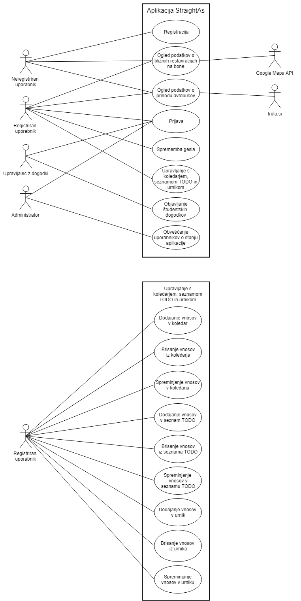

## 5. Funkcionalne zahteve

-------------------
### Registracija

#### Povzetek funkcionalnosti
Neregistriran uporabnik se lahko registrira in s tem pridobi dostop do več funkcionalnosti. Pri registraciji izpolni obrazec s svojim e-poštnim naslovom in geslom.
#### Osnovni tok
1. Neregistriran uporabnik izbere funkcionalnost registracija.
2. Aplikacija mu ponudi registracijski obrazec.
3. Neregistriran uporabnik v registracijski obrazec vpiše svoj e-poštni naslov in geslo, ki je dolgo vsaj 8 znakov.
4. Neregistriran uporabnik odda registracijski obrazec.
5. Aplikacija neregistriranemu uporabniku na e-poštni naslov pošlje sporočilo za potrditev registracije, ki je veljavno 2 dni.
6. Neregistriran uporabnik na svojem e-poštnem naslovu sledi povezavi za potrditev registracije.
7. Aplikacije pokaže sporočilo o uspešni povezavi.
#### Alternativni tok
**Alternativni tok 1**

1. Neregistriran uporabnik izbere funkcionalnost, ki je na voljo le registriranim uporabnikom.
2. Aplikacija mu prikaže obvestilo, da je dejavnost na voljo le registriranim uporabnikom in mu ponudi možnost, da opravi postopek registracije.
3. Neregistriran uporabnik izbere možnost nadaljevanja z registracijo (izbere funkcionalnost registracija).
4. Aplikacija mu ponudi registracijski obrazec.
3. Neregistriran uporabnik v registracijski obrazec vpiše svoj e-poštni naslov in geslo, ki je dolgo vsaj 8 znakov.
4. Neregistriran uporabnik odda registracijski obrazec.
5. Aplikacija neregistriranemu uporabniku na e-poštni naslov pošlje sporočilo za potrditev registracije.
6. Neregistriran uporabnik na svojem e-poštnem naslovu sledi povezavi za potrditev registracije.
7. Aplikacije pokaže sporočilo o uspešni registraciji.
#### Izjemni tok
**Izjemni tok 1**

* Uporabnik se je poskusil registrirati z e-poštnim naslovom, ki je že v uporabi. Aplikacija vrne obvestilo o zavrnjeni registraciji.

**Izjemni tok 2**

*  Neregistriran izpolne in odda registracijski obrazec, a ne potrdi svojega e-poštnega naslova v dveh dneh. Postopek registracije ni dokončan, zato se neregistriran uporabnik ne more prijaviti v aplikacijo.

**Izjemni tok 3**

*  Neregistriran uporabnik izpolni registracijski obrazec z geslom, ki je krajše od 8 znakov in ga poskuša oddati. Aplikacija vrne obvestilo o zavrnjeni registraciji.

#### Pogoji
* Pri funkcionalnosti registracija uporabnik ne sme biti prijavljen. Če je uporabnik registriran oziroma prijavljen mu ta funkcionalnost ni na voljo.
#### Posledice
* Če se neregistriran uporabnik uspešno registrira (tudi potrdi svoj e-poštni naslov), je zabeležen v sistemu in se sedaj lahko v aplikacijo prijavi s svojimi podatki. Uporabnik s tem dobi dostop do več funkcionalnosti aplikacije.
#### Posebnosti
Podatki o registraciji se pošiljajo po varni povezavi in so hranjeni z ustreznimi varnostnimi praksami.
#### Prioritete identificiranih funkcionalnosti
MUST HAVE
#### Sprejemni testi
* **[Osnovni tok]** Neregistriran uporabnik izpolne obrazec in se s tem registrira. Uporabnik se sedaj lahko prijavi v sistem.
* **[Alternativni tok 1]** Neregistriran uporabnik izbere funkcionalnost, ki je na voljo le registriranim uporabnikom. Aplikacija ga pozove k registraciji.
* **[Izjemni tok 1]** Neregistriran uporabnik se poskuša registrirati z e-poštnim naslovom, ki je že v uporabi. Aplikacija mu ne dovoli registracije in mu prikaže obvestilo, da naj uporabi drug e-poštni naslov.
* **[Izjemni tok 2]** Neregistriran uporabnik izpolne obrazec in ga odda, vendar ne potrdi svojega e-poštnega naslova. Če se želi prijaviti v aplikacijo, mu je to onemogočeno, saj njegov uporabniški račun ne obstaja.
* **[Izjemni tok 3]** Neregistriran uporabnik izpolne obrazec z geslom krajšim od 8-ih znakov. Aplikacija mu ne dovoli registracije in mu prikaže obvestilo, da naj vnese daljše geslo.

-------------------

### Prijava

#### Povzetek funkcionalnosti
Registriran uporabnik, upravljalec z dogodki ali administrator se lahko prijavi v aplikacijo s podatki, ki jih je uporabil pri registraciji. S tem pridobi dostop do več funkcionalnosti.
#### Osnovni tok [Registriran uporabnik]
1. Registriran uporabnik izbere funkcionalnost prijava.
2. Aplikacija mu ponudi prijavni obrazec.
3. Registriran uporabnik v prijavni obrazec vpiše e-poštni naslov in geslo, ki ju je vnesel pri registraciji.
4. Registriran uporabnik odda prijavni obrazec.
5. Registriran uporabnik je sedaj prijavljen v svoj profil na aplikaciji.
#### Osnovni tok [Upravljalec z dogodki]
1. Upravljalec z dogodki uporabnik izbere funkcionalnost prijava.
2. Aplikacija mu ponudi prijavni obrazec.
3. Upravljalec z dogodki v prijavni obrazec vpiše e-poštni naslov in geslo.
4. Upravljalec z dogodki odda prijavni obrazec.
5. Upravljalec z dogodki je sedaj prijavljen v svoj profil na aplikaciji.
#### Osnovni tok [Administrator]
1. Administrator uporabnik izbere funkcionalnost prijava.
2. Aplikacija mu ponudi prijavni obrazec.
3. Administrator v prijavni obrazec vpiše e-poštni naslov in geslo.
4. Administrator odda prijavni obrazec.
5. Administrator je sedaj prijavljen v svoj profil na aplikaciji.
#### Izjemni tok
**Izjemni tok 1**

* Registriran uporabnik se je poskusil prijaviti z napačnimi podatki. Aplikacija vrne primerno obvestilo in zavrne prijavo.

**Izjemni tok 2**

* Upravljalec z dogodki se je poskusil prijaviti z napačnimi podatki. Aplikacija vrne primerno obvestilo in zavrne prijavo.

**Izjemni tok 3**

* Administrator se je poskusil prijaviti z napačnimi podatki. Aplikacija vrne primerno obvestilo in zavrne prijavo.
#### Pogoji
* Pri funkcionalnosti prijava mora uporabnik že imeti uporabniški račun registriranega uporabnika, upravljalca z dogodki ali administratorja. Če je uporabnik že prijavljen mu funkcionalnost prijava ni na voljo.
#### Posledice
* Registriran uporabnik po uspešni prijavi dobi dostop do upravljanja s koledarjem, seznamom TODO in urnikom, spremembe gesla in ogledovanja dogodkov.
* Upravljalcu z dogodki je po uspešni prijavi omogočeno objavljanje študentskih dogodkov.
* Administratorju je po uspešni prijavi omogočen pregled stanja sistema.
#### Posebnosti
Podatki o prijavi se pošiljajo varni povezavi.
#### Prioritete identificiranih funkcionalnosti
MUST HAVE
#### Sprejemni testi
* **[Osnovni tok [Registriran uporabnik]]** Registriran uporabnik v prijavni obrazec vpiše podatke in ga odda. Sedaj je prijavljen v svoj račun.
* **[Osnovni tok [Upravljalec z dogodki]]** Upravljalec z dogodki v prijavni obrazec vpiše podatke in ga odda. Sedaj je prijavljen v svoj račun.
* **[Osnovni tok [Administrator]]** Administrator v prijavni obrazec vpiše podatke in ga odda. Sedaj je prijavljen v svoj račun.
* **[Izjemni tok 1]** Registriran uporabnik vpiše napačen e-poštni naslov in/ali geslo. Aplikacija zavrne poskus prijave.
* **[Izjemni tok 2]** Upravljalec z dogodki vpiše napačen e-poštni naslov in/ali geslo. Aplikacija zavrne poskus prijave.
* **[Izjemni tok 3]** Administrator vpiše napačen e-poštni naslov in/ali geslo. Aplikacija zavrne poskus prijave.

-------------------

### Sprememba gesla

#### Povzetek funkcionalnosti
Registriran uporabnik izbere funkcionalnost spremembe gesla. Geslo lahko spremeni z dvakratnim vnosom trenutnega gesla, vnosom novega gesla potrditvijo spremembe gesla.
#### Osnovni tok
1. Registriran uporabnik izbere funkcionalnost spremembe gesla.
2. Aplikacija prikaže obrazec za spremembo geslo.
3. Registriran uporabnik v prvi dve vnosni polji obrazca vnese trenutno geslo, v tretje vnosno polje pa novo geslo. Novo geslo je dolgo vsaj 8 znakov.
4. Registriran uporabnik potrdi spremembo gesla.
5. Aplikacija prikaže sporočilo o uspešni spremembi gesla.

#### Alternativni tok
Alternativnih tokov aplikacija ne podpira.

#### Izjemni tokovi

**Izjemni tok 1**

* Registriran uporabnik v vsaj eno izmed prvih dveh vnosnih polj vnese napačno geslo. Aplikacija prikaže ustrezno obvestilo.

**Izjemni tok 2**

* Registriran uporabnik v tretje vnosno polje vpiše geslo, ki je krajše od 8 znakov. Aplikacija prikaže ustrezno obvestilo.

#### Pogoji
* Funkcionalnost je omogočena le prijavljenemu registriranemu uporabniku.

#### Posledice
* Registrirani uporabnik ima spremenjeno geslo. Sprememba se odraža v zalednem sistemu, ki hrani uporabniške podatke.

#### Posebnosti
Podatki o spremembi gesla se pošiljajo varni povezavi.

#### Prioritete identificiranih funkcionalnosti
SHOULD HAVE

#### Sprejemni testi
* **[Osnovni tok]** Registriran uporabnik izpolni obrazec za spremembo geslo in spremembo potrdi. Registriran uporabnik ima sedaj novo geslo, ki se v kriptirani obliki nahaja v zalednem sistemu.
* **[Izjemni tok 1]** Registriran uporabnik izpolni obrazec za spremembo geslo, pri čemer v vsaj eno izmed prvih dveh vnosnih polj vpiše napačno geslo. Ne pride do spremembe gesla in aplikacija ga o tem obvesti.
* **[Izjemni tok 2]** Registriran uporabnik izpolni obrazec za spremembo geslo, pri čemer v tretje vnosno polje vpiše geslo, krajše od 8 znakov. Ne pride do spremembe gesla in aplikacija ga o tem obvesti.

-------------------

### Dodajanje vnosa v koledar

#### Povzetek funkcionalnosti
Registriran uporabnik lahko doda vnos v koledar in pri tem določi njegov naziv, opis, trajanje in čas začetka. 
#### Osnovni tok
1. Registriran uporabnik označi datum na koledarju in izbere funkcionalnost dodajanja vnosa v koledar.
2. Aplikacija mu ponudi vnosni obrazec.
3. Registriran uporabnik izpolni vnosni obrazec s podatki o nazivu, opisu, trajanju in času začetka dogodka.
4. Registriran uporabnik potrdi dodajanje vnosa v koledar.
5. Aplikacija v koledarju izriše nov vnos.
### Alternativni tok
Alternativnih tokov aplikacija ne podpira.
### Izjemni tok
* Registriran uporabnik ne potrdi dodajanja vnosa. Aplikacija zavrže podatke.
#### Pogoji
* Za dodajanje vnosa v koledar mora uporabnik biti registriran in prijavljen.
#### Posledice
* Rezultat te funkcionalnosti je ustvarjen vnos, ki ga uporabnik sedaj lahko vidi v koledarju.
#### Posebnosti
Posebnosti ni.
#### Prioritete identificiranih funkcionalnosti
SHOULD HAVE
#### Sprejemni testi
* **[Osnovni tok]** Registriran uporabnik izpolni in potrdi vnosni obrazec. V svojem koledarju sedaj vidi vnos s pravilnim nazivom, opisom in trajanjem ter na na pravilnem času začetka.
* **[Izjemni tok]** Registriran uporabnik lahko izpolni, a ne potrdi vnosnega obrazca. V koledarju se vnos ne izriše, aplikacija pa zavrže vnešene podatke.

-------------------

### Brisanje vnosa iz koledarja

#### Povzetek funkcionalnosti
Registrirani uporabnik izbere vnos na svojem koledarju in izbere funkcionalnost brisanja vnosa. Ko na novem obvestilu potrdi brisanje, se vnos dokončno izbriše iz koledarja.
#### Osnovni tok
1. Registrirani uporabnik izbere enega izmed vnosov na svojem koledarju.
2. Izbere funkcionalnost brisanja vnosa iz koledarja.
3. Aplikacija mu odpre obvestilo, če res želi vnos dokončno izbrisati.
4. Registrani uporabnik potrdi brisanje.
5. Izbran vnos se izbriše iz koledarja.
#### Alternativni tok
Alternativnih tokov aplikacija ne podpira.
#### Izjemni tok
* Registrirani uporabnik izbere enega izmed vnosov in funkcionalnost brisanja, a tega dokončno ne potrdi. Aplikacija vnosa iz koledarja ne izbriše.
#### Pogoji
* Uporabnik mora biti registriran in prijavljen, prav tako mora imeti v svojem koledarju vnos, ki ga je moč izbrisati.
#### Posledice
* Izbrisanega vnosa ni več v koledarju registriranega uporabnika.
#### Posebnosti
Posebnosti ni.
#### Prioritete identificiranih funkcionalnosti
SHOULD HAVE
#### Sprejemni testi
* **[Osnovni tok]** Registriran uporabnik izbere enega od vnosov na svojem koledarju in funkcionalnost brisanja ter to na prikazanem obvestilu tudi potrdi. Vnosa ni več v koledarju registriranega uporabnika.
* **[Izjemni tok]** Registriran uporabnik izbere enega od vnosov na svojem koledarju in funkcionalnost brisanja, a tega ne potrdi na prikazanem obvestilu. Vnos ostane v koledarju registriranega uporabnika.

-------------------

### Urejanje vnosa v koledarju

#### Povzetek funkcionalnosti
Registrirani uporabnik izbere vnos na svojem koledarju in uporabi funkcionalnost urejanja vnosa. Tako mu lahko spremeni naziv, opis, čas začetka ali trajanje.
#### Osnovni tok
1. Registrirani uporabnik izbere enega izmed vnosov v svojem koledarju.
2. Registrirani uporabnik izbere funkcionalnost urejanja vnosa.
3. Aplikacija mu odpre obrazec za urejanje vnosa, kjer so že izpolnjeni podatki s trenutnimi vrednostmi.
4. Registrani uporabnik spremeni nekatere izmed podatkov o vnosu in izbere možnost shranjevanja sprememb.
5. Vnos na koledarju ima posodobljene podatke.
#### Alternativni tok
Alternativnih tokov aplikacija ne podpira.
#### Izjemni tok
* Registriran uporabnik izbere vnos in funkcionalnost urejanja. Podatke o vnosu spremeni, a jih ne shrani. Aplikacija zavrže spremembe.
#### Pogoji
* Uporabnik mora biti registriran in prijavljen, prav tako mora imeti imeti v svojem koledarju vnos, ki ga je moč urediti.
#### Posledice
* Izbran vnos ima urejene podatke.
#### Posebnosti 
Posebnosti ni.
#### Prioritete identificiranih funkcionalnosti
COULD HAVE
#### Sprejemni testi
* **[Osnovni tok]** Registriran uporabnik izbere enega od vnosov na svojem koledarju in izbere funkcionalnost urejanja. Na prikazanem obrazcu spremeni nekatere podatke. Ko potrdi spremembe ima urejen vnos prave posodobljene vrednosti.
* **[Izjemni tok]** Registriran uporabnik izbere enega od vnosov na svojem koledarju in izbere funkcionalnost urejanja. Na prikazanem obrazcu spremeni nekatere podatke, a sprememb ne shrani. Izbran vnos ima stare, neposodobljene vrednosti.

-------------------

### Ogled podatkov o bližnjih restavracijah na bone

#### Povzetek funkcionalnosti
Neregistriran ali registriran uporabnik izbere funkcionalnost ogleda podatkov o bližnjih restavracijah na bone. Prikažeta se mu seznam in zemljevid bližnjih restavracij in nekateri osnovni podatki o le-teh (naslov, cena obroka). 
#### Osnovni tok
1. Neregistriran ali registriran uporabnik izbere funkcionalnost ogleda podatkov o restavracijah na bone.
2. Aplikacija ga vpraša za dovoljenje dostopanje do uporabnikove lokacije.
3. Neregistriran ali registriran uporabnik aplikaciji odobri dostop do lokacije.
4. Aplikacija neregistriranemu ali registriranemu uporabniku prikaže seznam bližnjih restavracij na bone z osnovnimi podatki urejene po oddaljenosti od uporabnikove lokacije, prav tako mu prikaže zemljevid, centriran na uporabnikovo lokacijo, z označenimi restavracijami.
#### Alternativni tok
1. Neregistriran ali registriran uporabnik izbere funkcionalnost ogleda podatkov o restavracijah na bone.
2. Aplikacija ga vpraša za dovoljenje dostopanje do uporabnikove lokacije.
3. Neregistriran ali registriran uporabnik zavrne dovoljenje za dostop do lokacije.
4. Aplikacija neregistriranemu ali registriranemu uporabniku prikaže seznam vseh možnih restavracij na bone z osnovnimi podatki urejen po abecedi, prav tako mu prikaže zemljevid centriran na center Ljubljane, kjer lahko uporabnik sam poišče najbližjo restavracijo.
#### Izjemni tok
* Ni smiselnih izjemnih tokov.
#### Pogoji
* Ni pogojev.
#### Posledice
* Uporabniku je prikazan seznam restavracij na bone urejen po abecedi ali oddaljenosti od uporabnikove lokacije.
#### Posebnosti
Podatke o restavracijah na bone bo aplikacija prebrala iz podatkovne baze. Te podatke bomo predhodno pridobili iz spletnega mesta https://www.studentska-prehrana.si/sl/restaurant, saj se ne spreminjajo pogosto, zato ni potrebe po pridobivanju novih podatkov ob vsaki ponovni izbiri te funkcionalnosti.
Za prikaz zemljevida in lokacij restavracij, bo aplikacija uporabljala Google Maps API.
#### Prioritete identificiranih funkcionalnosti
MUST HAVE
#### Sprejemni testi
* **[Osnovni tok]** Neregistriran ali registriran izbere funkcionalnost ogleda podatkov o restavracijah na bone in odobri dostop do lokacije. Aplikacija mu prikaže seznam, kjer so restavracije urejene po oddaljenosti od uporabnikove lokacije, in zemljevid, kjer so prikazane vse restavracije in ki je centriran na uporabnikov lokacijo.
* **[Alternativni tok]** Neregistriran ali registriran izbere funkcionalnost ogleda podatkov o restavracijah na bone in zavrne dostop do lokacije. Aplikacija mu prikaže seznam, kjer so restavracije urejene po abecedi, in zemljevid, kjer so prikazane vse restavracije in ki je centriran na center Ljubljane.

-------------------

### Iskanje podatkov o prihodu avtobusov

#### Povzetek funkcionalnosti
Neregistriran ali registriran uporabnik lahko poišče podatke o prihodu avtobusov na postajo, ki jo vnese v obrazec za iskanje. 
#### Osnovni tok
1. Neregistrirani ali registrirani uporabnik izbere funkcionalnost iskanja podatkov o prihodu avtobusov.
2. Aplikacija mu odpre zaslon, na katerem je obrazec za iskanje.
3. Neregistriran ali registriran uporabnik v obrazec za iskanje vnese ime željene postaje.
4. Aplikacija mu prikaže seznam avtobusov s časi prihoda za iskano postajo.
#### Alternativni tok
1. Neregistrirani ali registrirani uporabnik izbere funkcionalnost iskanja podatkov o prihodu avtobusov.
2. Aplikacija mu odpre zaslon, na katerem je obrazec za iskanje.
3. Neregistriran ali registriran uporabnik v obrazec za iskanje vnese identifikacijsko številko željene postaje.
4. Aplikacija mu prikaže seznam avtobusov s časi prihoda za iskano postajo.
#### Izjemni tokovi

**Izjemni tok 1**

* Neregistrirani ali registrirani v obrazec za iskanje vnese ime postaje, ki ne obstaja. Aplikacija mu prikaže obvestilo o napaki.

**Izjemni tok 2**

* Neregistrirani ali registrirani v obrazec za iskanje vnese identifikacijsko številko postaje, ki ne obstaja. Aplikacija mu prikaže obvestilo o napaki.

#### Pogoji
* Ni pogojev.
#### Posledice
* Uporabniku je prikazan seznam avtobusnih postaj in pripadajočih avtobusnih odhodih, urejen po abecedi ali oddaljenosti od lokacije.
#### Posebnosti
Aplikacije bo za podatke o prihodu avtobusov uporabljala trola.si API. Obstoj postaje z imenom ali identifikacijsko številko bomo preverili s podatki iz podatkovne baze, kjer bomo hranili imena in identifikacijske številke vseh možnih postaj.
#### Prioritete identificiranih funkcionalnosti
COULD HAVE
#### Sprejemni testi
* **[Osnovni tok]** Neregistriran ali registriran izbere funkcionalnost iskanja podatkov o prihodu avtobusov. V obrazec za iskanje vnese ime željene postaje. Aplikacija mu prikaže seznam avtobusov s časi prihoda za to postajo.
* **[Alternativni tok]** Neregistriran ali registriran izbere funkcionalnost iskanja podatkov o prihodu avtobusov. V obrazec za iskanje vnese identifikacijsko številko željene postaje. Aplikacija mu prikaže seznam avtobusov s časi prihoda za to postajo.
* **[Izjemni tok 1]** Neregistriran ali registriran izbere funkcionalnost iskanja podatkov o prihodu avtobusov. V obrazec za iskanje vnese ime postaje, ki ne obstaja. Aplikacija mu prikaže obvestilo o napaki.
* **[Izjemni tok 2]** Neregistriran ali registriran izbere funkcionalnost iskanja podatkov o prihodu avtobusov. V obrazec za iskanje vnese identifikacijsko številko postaje, ki ne obstaja. Aplikacija mu prikaže obvestilo o napaki.

-------------------

### Dodajanje vnosov v urnik

#### Povzetek funkcionalnosti
Registriran uporabnik lahko doda vnos v urnik tako, da izbere polje v urniku, pri tem pa določi naziv, trajanje in prikazno barvo.
#### Osnovni tok
1. Registriran uporabnik izberega enega izmed polj na urniku.
2. Aplikacija mu odpre manjši obrazec, na katerem so polja za naziv, trajanje in prikazno barvo.
3. Registriran uporabnik izpolni obrazec vnos v urnik.
4. Registriran uporabnik potrdi dodajanje.
5. Aplikacija na urniku izriše nov vnos, pri čemer je polje določene barve in na njem je izpisan naziv.
#### Alternativni tok
Alternativnih tokov aplikacija ne podpira.
#### Izjemni tok
* Ni smiselnih izjemnih tokov.
#### Pogoji
* Za dodanjanje vnosa v urnik mora uporabnik biti registriran in prijavljen. Prav tako mora biti na zaslonu funkcionalnosti Ogled dogodkov in obveznosti
#### Posledice
* Rezultat te funkcionalnosti je ustvarjen vnos v uporabnikovem urniku. Vnos ima naziv in barvo.
#### Posebnosti
Posebnosti ni.
#### Prioritete identificiranih funkcionalnosti
MUST HAVE
#### Sprejemni testi
* **[Osnovni tok]** Registiran uporabnik uporabi funkcionalnost Dodajanje vnosa v urnik. V urniku se mu mora izrisati vnos s pravilno barvo in nazivom.

-------------------

### Urejanje vnosa v urniku

#### Povzetek funkcionalnosti
Registriran uporabnik lahko uredi vnos v urniku, tako da pritisne na njegovo polje. Spremeni lahko naziv ali barvo polja.
#### Osnovni tok
1. Registriran uporabnik izberega enega izmed polj na urniku, na katerem se že nahaja ustvarjen vnos.
2. Aplikacija mu odpre manjši obrazec, na katerem so polja za naziv, trajanje in barvo, ki vsebujejo shranjene vrednosti.
3. Registriran uporabnik uredi podatke vnosa po svojih želji.
4. Registriran uporabnik potrdi spremembo.
5. Aplikacija na urniku posodobi vnos, pri čemer sta naziv in barva polja nastavljena na nove vrednosti.
#### Alternativni tok
Alternativnih tokov aplikacija ne podpira.
#### Izjemni tok
* Ni smiselnih izjemnih tokov.
#### Pogoji
* Za urejanje vnosa v urniku mora uporabnik biti registriran in prijavljen. Da lahko funkcionalnost izbere se mora nahajati na zaslonu funkcionalnosti Ogled dogodkov in obveznosti, ter mora imeti vnos v urniku.
#### Posledice
* Rezultat te funkcionalnosti je posodobljen vnos v urniku.
#### Posebnosti
Posebnosti ni.
#### Prioritete identificiranih funkcionalnosti
WOULD HAVE
#### Sprejemni testi
* **[Osnovni tok]** Registiran uporabnik izbere že prej ustvarjen vnos v urniku. Po potrditvi sprememb se mu v urniku posobodi vnos na nove vrednosti.

-------------------

### Brisanje vnosa iz urnika

#### Povzetek funkcionalnosti
Registriran uporabnik lahko izbriše vnos iz urnika, tako da pritisne nanj in izbere brisanje.
#### Osnovni tok
1. Registriran uporabnik izberega enega izmed polj na urniku.
2. Aplikacija mu odpre manjši obrazec, identičen tistemu za urejanje. Na njem je tudi možnost brisanja.
3. Registriran uporabnik izbere funkcionalnost brisanja vnosa.
4. Aplikacija iz urnika odstrani izbrisan vnos.
#### Alternativni tok

Alternativnih tokov aplikacija ne podpira.

#### Izjemni tok
* Ni smiselnih izjemnih tokov.

#### Pogoji
* Za brisanje vnosa iz urnika mora uporabnik biti registriran in prijavljen. Da lahko funkcionalnost izbere se mora nahajati na zaslonu funkcionalnosti _Ogled dogodkov in obveznosti_, ter mora imeti vnos v urniku.
#### Posledice
* Rezultat te funkcionalnosti je izbris vnosa iz uporabnikovega urnika.
#### Posebnosti
Posebnosti ni.
#### Prioritete identificiranih funkcionalnosti
MUST HAVE
#### Sprejemni testi
* **[Osnovni tok]** Registiran uporabnik uporabi funkcionalnost _Brisanja vnosa iz urnika_. Tega vnosa v urniku ni več.

-------------------
### Dodajanje vnosov v seznam TODO

#### Povzetek funkcionalnosti

Registriran uporabnik doda vnos v seznam TODO.

#### Osnovni tok

1. Registriran uporabnik izbere funkcinalnost dodajanja vnosa v seznam TODO.
2. Aplikacija doda vnosno polje v seznam TODO.
3. Registriran uporabnik vpiše vnos v vnosno polje.
4. Aplikacija shrani vnos v vnosno polje.

#### Alternativni tok

Alternativnih tokov aplikacija ne podpira.

#### Izjemni tok

* Ni smiselnih izjemnih tokov.

#### Pogoji

* Uporabnik mora biti v pogledu "Home".

#### Posledice

* V seznamu TODO je prisoten nov vnos.

#### Posebnosti

Posebnosti ni.

#### Prioritete identificiranih funkcionalnosti

MUST HAVE

#### Sprejemni testi

* **[Osnovni tok]** Registriran uporabnik doda nov vnos v seznam TODO. Na seznamu TODO obstaja nova naloga.

-------------------
### Spreminjanje vnosov v seznamu TODO

#### Povzetek funkcionalnosti

Registriran uporabnik spremeni vnos v seznamu TODO.

#### Osnovni tok

1. Registriran uporabnik dvakrat klikne na obstoječi vnos v seznamu TODO.
2. Registriran uporabnik lahko spremeni vsebino obstoječega vnosa.
3. Aplikacija si zabeleži popravilo vnosa.

#### Alternativni tok

Alternativnih tokov aplikacija ne podpira.

#### Izjemni tok

* Ni smiselnih izjemnih tokov.

#### Pogoji

* Uporabnik mora biti v pogledu "Home".

#### Posledice

* Vnos v seznamu TODO je spemenjen.

#### Posebnosti

Posebnosti ni.

#### Prioritete identificiranih funkcionalnosti

WOULD HAVE

#### Sprejemni testi

* **[Osnovni tok]** Registriran uporabnik spremeni obstoječi vnos v seznamu TODO. V seznamu TODO je spremenjen vnos. 

---------------------------------------------

### Brisanje vnosov iz seznama TODO

#### Povzetek funkcionalnosti

Registriran uporabnik izbriše vnos iz seznama TODO.

#### Osnovni tok

1. Registriran uporabnik izbere vnos v seznamu TODO in izbere funkcionalnost izbrisa vnosa.
2. Aplikacija mu ponudi obvestilo za potrditev izbrisa.
3. Registriran uporabnik potrdi izbris.
4. Aplikacija iz seznama TODO odstrani vnos.

#### Alternativni tok

Alternativnih tokov aplikacija ne podpira.

#### Izjemni tok

1. Registriran uporabnik ne potrdi izbrisa vnosa.

#### Pogoji

* Uporabnik mora biti v pogledu "Home". V seznamu TODO so prisotni vnosi.

#### Posledice

- V seznamu TODO je prisoten en vnos manj.

#### Posebnosti

Posebnosti ni.

#### Prioritete identificiranih funkcionalnosti

MUST HAVE

#### Sprejemni testi

- **[Osnovni tok]** Registriran uporabnik izbriše obstoječi vnos v seznamu TODO. V seznamu TODO izbrisan vnos ni več prisoten. 
- **[Izjemni tok]** Registriran uporabnik prekine izbris obstoječega vnosa iz seznama TODO. V seznamu TODO je vnos še vedno prisoten. 

-------------------------------------------------

### Objavljanje študentskih dogodkov

#### Povzetek funkcionalnosti

Upravljalec z dogodki objavlja študentske dogodke katere si lahko registrirani uporabniki ogledajo.

#### Osnovni tok

1. Upravljalec z dogodki izbere funkcionalnost objavi dogodke.
2. Aplikacija mu prikaže obrazec za objavo dogodka.
3. Uporavljalec z dogodki izpolni obrazec.
4. Upravljalec z dogodki potrdi objavo dogodka.
5. Dogodek je sedaj javno objavljen.

#### Alternativni tok

Alternativnih tokov aplikacija ne podpira.

#### Izjemni tok

1. Upravljalec z dogodki ne potrdi objave dogodka.

#### Pogoji

- Upravljalec z dogodki je prijavljen.

#### Posledice

- Objavljen dogodek je javno viden vsem registriranim uporabnikom in upravljalcu z dogodki.

#### Posebnosti

Posebnosti ni.

#### Prioritete identificiranih funkcionalnosti

SHOULD HAVE

#### Sprejemni testi

- **[Osnovni tok]** Upravljalec z dogodki objavi študentski dogodek. Objavljen dogodek je viden vsem registriranim uporabnikom in upravljalcu z dogodki.
- **[Izjemni tok]** Upravljalec z dogodki začne z objavo dogodka vendar postopek prekine. Aplikacija ne objavi novega dogodka.

-------------------------------------

### Obveščanje uporabnikov o stanju aplikacije

#### Povzetek funkcionalnosti

Administrator s pošiljanjem sistemskih sporočil uporabnike in upravljalce z dogodki obvešča o stanju aplikacije.

#### Osnovni tok

1. Administrator izbere funkcionalnost objavljanja obvestil.
2. Aplikacija mu prikaže obrazec za objavo obvestila.
3. Administrator izpolni obrazec.
4. Administrator potrdi objavo obvestila.
5. Obvestilo je sedaj javno objavljeno.

#### Alternativni tok

Alternativnih tokov aplikacija ne podpira.

#### Izjemni tok

1. Administrator ne potrdi objave obvestila.

#### Pogoji

- Administrator je prijavljen.

#### Posledice

- Objavljeno obvestilo je javno viden vsem uporabnikom aplikacije in upravljalcem z dogodki.

#### Posebnosti

Posebnosti ni.

#### Prioritete identificiranih funkcionalnosti

MUST HAVE

#### Sprejemni testi

- **[Osnovni tok]** Administrator objavi obvestilo o stanju aplikacije. Objavljeno obvestilo je vidno vsem uporabnikom in upravljalcem z dogodki.
- **[Izjemni tok]** Administrator začne z objavo obvestila vendar postopek prekine. Aplikacija ne objavi novega obvestila.

## 6. Nefunkcionalne zahteve

V tem razdelku so navedene splošne omejitve, ki morajo biti upoštevane v več funkcionalnostih oz. skozi celoten razvoj aplikacije.

* **(Zahteva izdelka)** Aplikacija neregistriranim uporabnikom in registriranim uporabnikom ne sme dovoliti dejanj administratorja in upravljalca z dogodki.
* **(Zahteva izdelka)** Aplikacija mora biti na voljo najmanj 95 odstotkov časa.
* **(Zahteva izdelka)** Aplikacija mora biti zmožna podpirati najmanj 100 hkratnih uporabnikov.
* **(Zahteva izdelka)** Aplikacija mora zahteve neregistriranih uporabnikov in registriranih uporabnikov obdelati v največ 3 sekundah.
* **(Zahteva izdelka)** Vsak pogled v spletni aplikaciji mora vsebovati manj kot 20 gumbov.
* **(Organizacijska zahteva)** Neregistrirani uporabnik mora pri registraciji navesti veljavni e-poštni naslov.
* **(Organizacijska zahteva)** V razvoju aplikacije bo uporabljeno orodje Git za upravljanje z izvorno kodo.
* **(Zunanja zahteva)** Aplikacija mora biti dosegljiva na javno dostopnem spletnem naslovu.
* **(Zunanja zahteva)** Hranjenje podatkov mora biti skladno z zakoni o varstvu podatkov, npr. GDPR.

## 7. Osnutki zaslonskih mask

#### 1. Domača stran

​	**Funkcionalne zahtevnosti:** /

​	**Akterji:** Registriran uporabnik, Spreminjanje vnosov v seznamu TODO

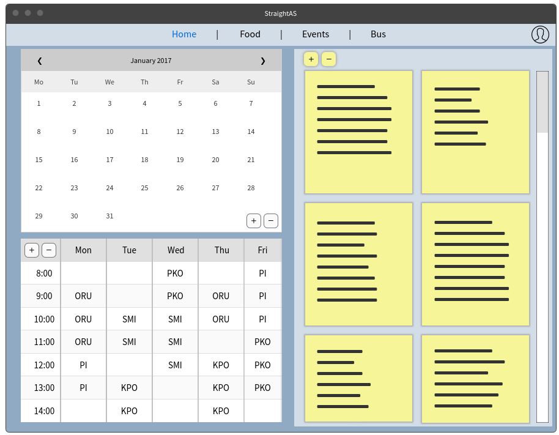

#### 2. Pregled restavracij

​	**Funkcionalne zahtevnosti:** Ogled podatkov o bližnjih restavracijah na bone

​	**Akterji:** Registriran uporabnik, Neregistriran uporabnik

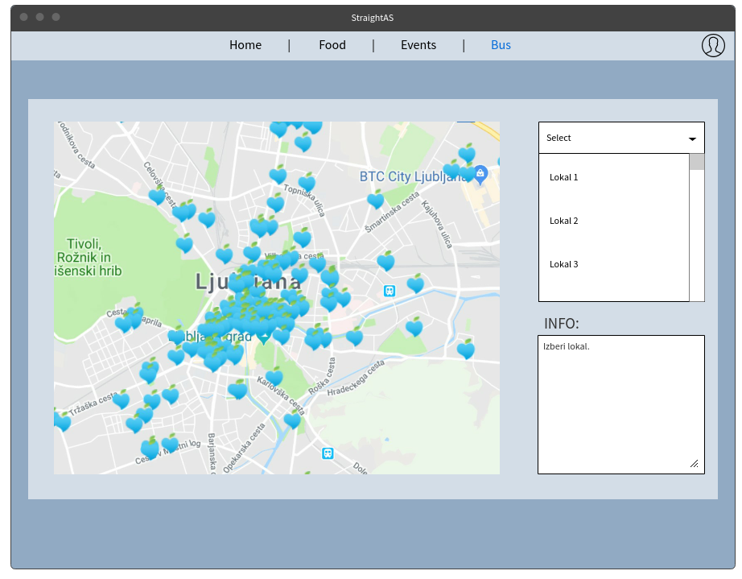

#### 3. Pregled dogodkov

​	**Funkcionalne zahtevnosti:** /

​	**Akterji:** Registriran uporabnik, Neregistriran uporabnik

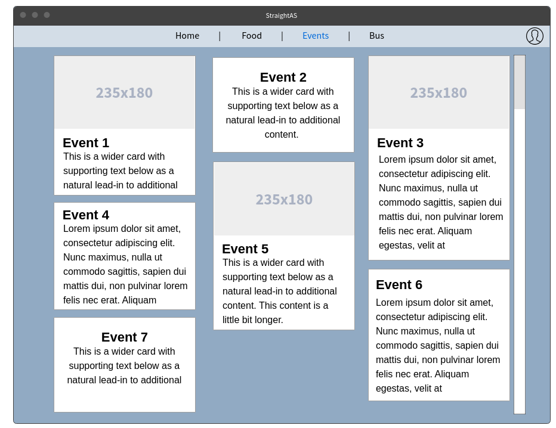

#### 4. Dodajanje vnosa v urnik

​	**Funkcionalne zahtevnosti:** Dodajanje vnosov v urnik

​	**Akterji:** Registriran uporabnik

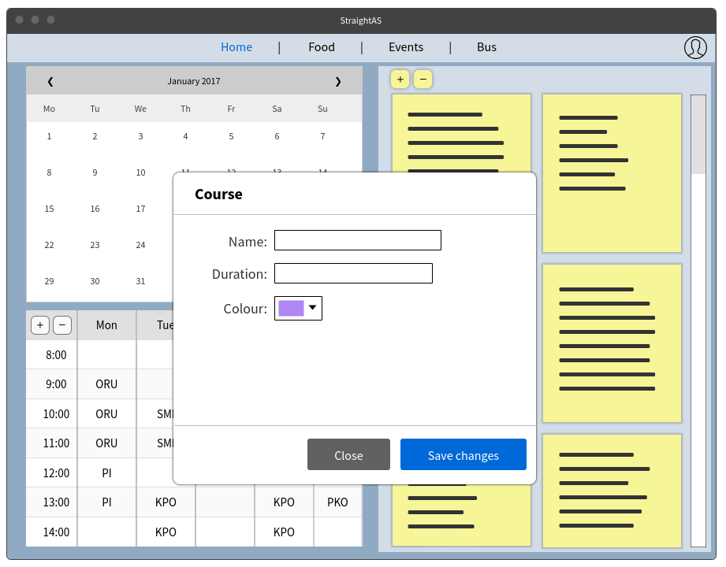
#### 5. Urejanje vnosa v urnik

​	**Funkcionalne zahtevnosti:** Urejanje vnosa v urniku

​	**Akterji:** Registriran uporabnik

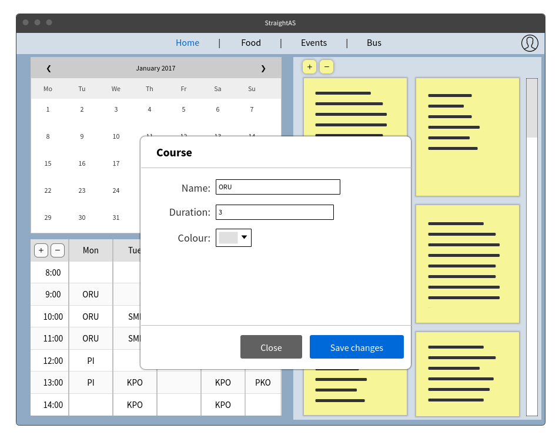

#### 6. Dodajanje vnosa v koledar

​	**Funkcionalne zahtevnosti:** Dodajanje vnosov v koledar

​	**Akterji:** Registriran uporabnik

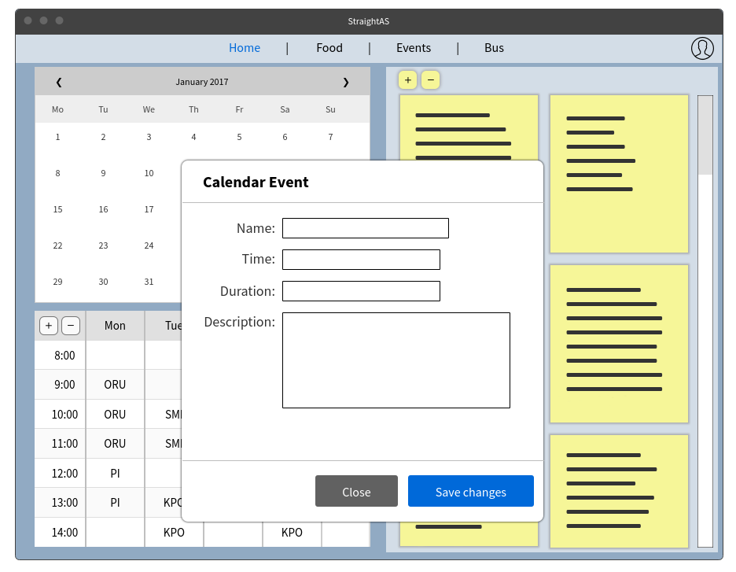

#### 7. Urejanje vnosa v koledarju

​	**Funkcionalne zahtevnosti:** Urejanje vnosa v koledarju

​	**Akterji:** Registriran uporabnik

#### 8. Dodajanje vnosa v seznam TODO

​	**Funkcionalne zahtevnosti:** Dodajanje vnosov v seznam TODO

​	**Akterji:** Registriran uporabnik

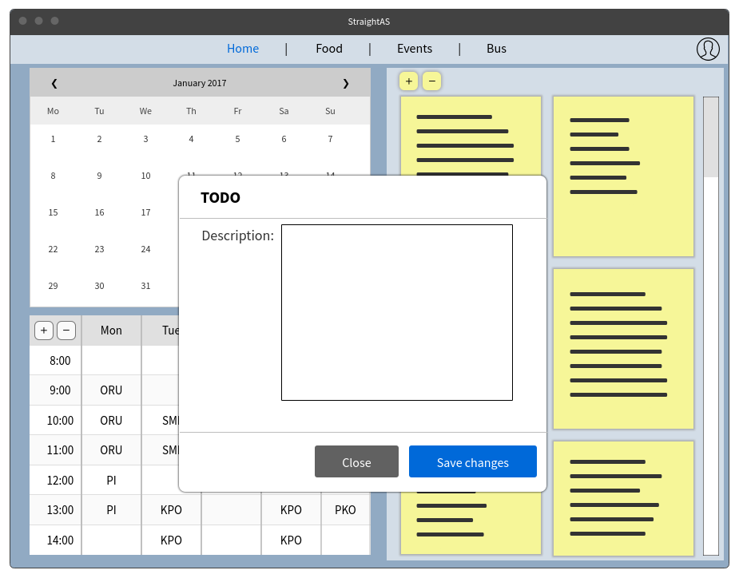

#### 9. Potrditev brisanja vnosov 

​	**Funkcionalne zahtevnosti:** Brisanje vnosov iz urnika, Brisanje vnosov v koledarju, Brisanje vnosov iz seznama TODO

​	**Akterji:** Registriran uporabnik

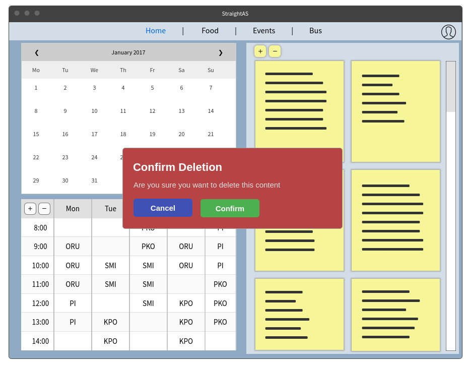

#### 10. Domača stran upravljalca z dogodki 

​	**Funkcionalne zahtevnosti:** /

​	**Akterji:** Upravljalec z dogodki

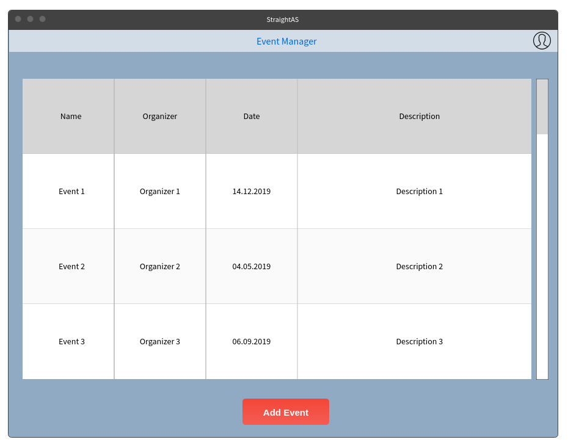

#### 11. Dodajanje dogodkov 

​	**Funkcionalne zahtevnosti:** Objavljanje študentskih dogodkov

​	**Akterji:** Upravljalec z dogodki

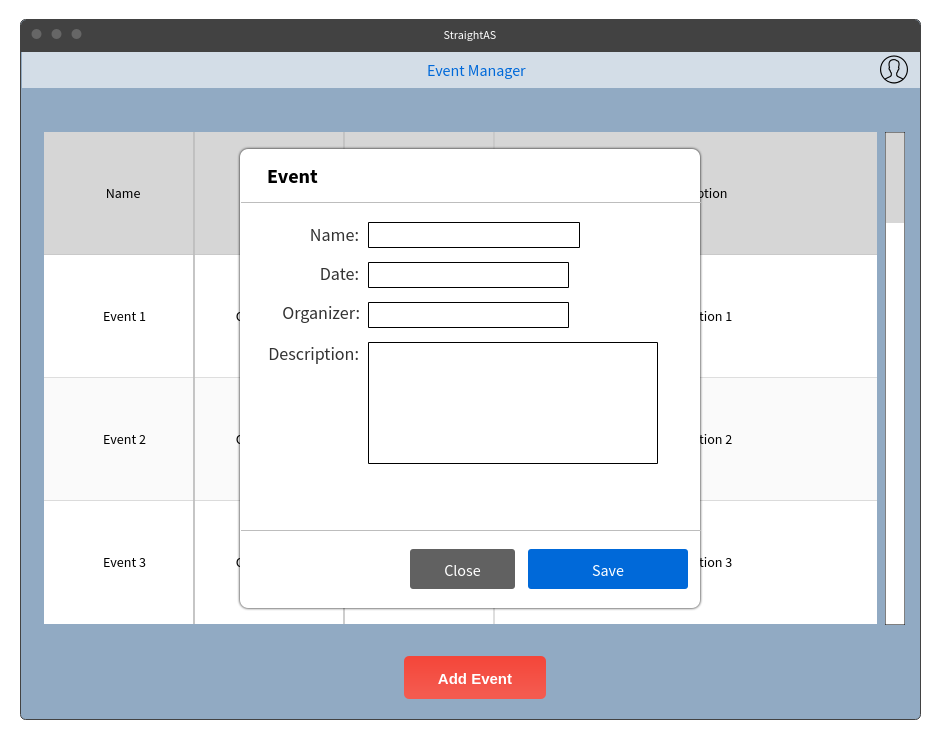

#### 12. Registracija

​	**Funkcionalne zahtevnosti:** Registracija

​	**Akterji:** Neregistriran uporabnik

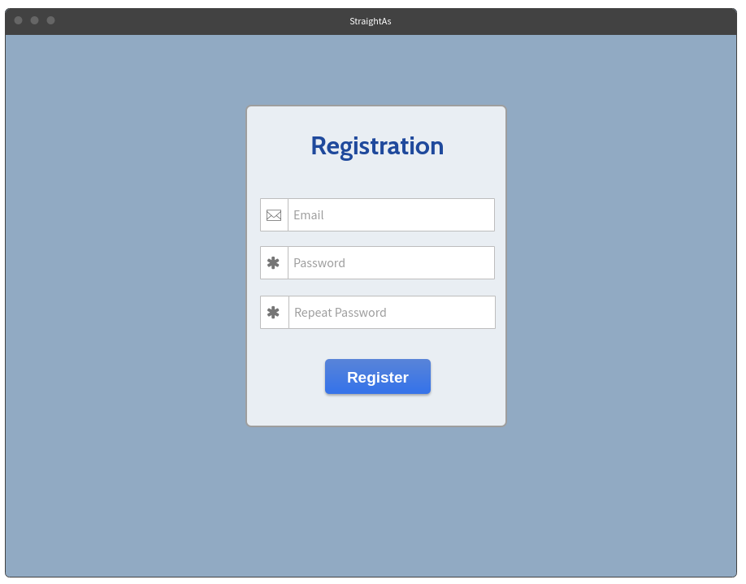

#### 13. Prijava

​	**Funkcionalne zahtevnosti:** Prijava

​	**Akterji:** Registriran uporabnik, upravljalec z dogodki, administrator

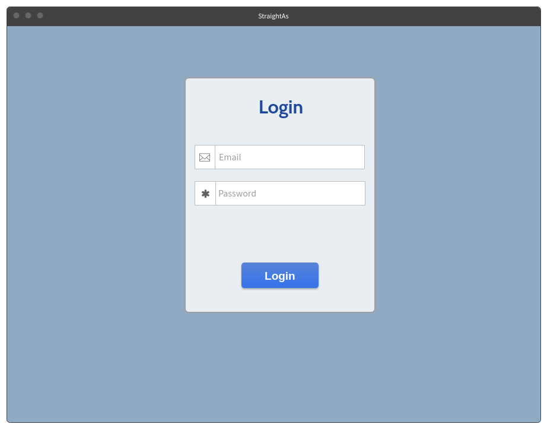

#### 14. Sprememba gesla

​	**Funkcionalne zahtevnosti:** Sprememba gesla

​	**Akterji:** Registriran uporabnik, upravljalec z dogodki, administrator

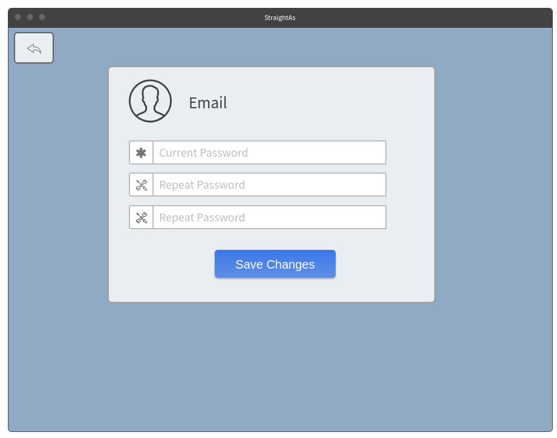

#### 15. Domača stran administratorja

​	**Funkcionalne zahtevnosti:** /

​	**Akterji:** Administrator

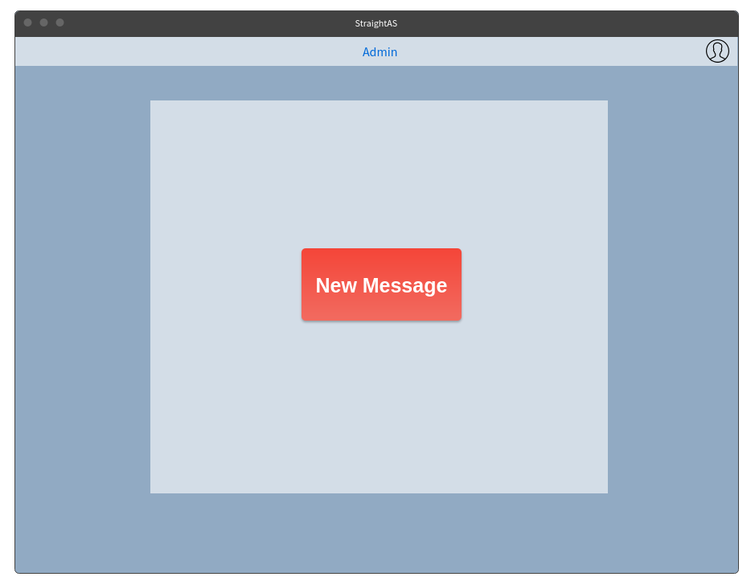

#### 16. Obveščanje uporabnikov o stanju aplikacije

​	**Funkcionalne zahtevnosti:** Obveščanje uporabnikov o stanju aplikacije

​	**Akterji:** Administrator

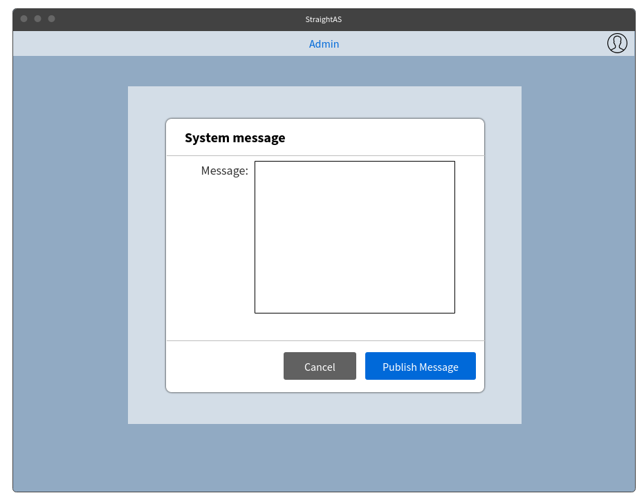

## 8. Vmesniki do zunanjih naprav

### Google Maps API

**Uporaba: interakcija med Google Maps API in funkcionalnostjo Ogled podatkov o bližnjih restavracijah na bone.**

Najprej si bomo zagotovili ključ za uporabo API-ja. Sam API bo aplikacija naložila iz spletnega naslova: "https://maps.googleapis.com/maps/api/js?key=[API-ključ]&callback=[povratna-funkcija]", kjer bo [API-ključ] naš ključ za uporabo Google Maps API-ja in [povratna-funkcija] metoda, ki bo izvršena po uspešni naložitvi API-ja in bo inicializirala zemljevid.

Ko bo registriran ali neregistriran uporabnik izbral funkcionalnost ogleda podatkov o bližnjih restavracijah na bone, ga bo aplikacija najprej vprašala za dovoljenje za dostop do njegove lokacije:

* če bo uporabnik aplikaciji odobril dostop, bomo zemljevid centrirali na njegovo lokacijo

* če uporabnik aplikaciji ne bo odobril dostopa do svoje lokacije, bomo zemljevid centrirali na center Ljubljane

Podatke o restavracijah bo aplikacija prebrala iz datoteke iz podatkovne baze, kamor bomo predhodno zapisali podatke iz spletnega mesta https://www.studentska-prehrana.si/. Če bo uporabnik aplikaciji dovolil dostop do svoje lokacije, bo aplikacija restavracije uredila po oddaljenosti do uporabnika, drugače pa po abecedi.

Za vsako restavracijo bo aplikacija na zemljevidu izrisala oznako na njeni lokaciji. To bo storila z naslednjim postopkom:

* najprej bo izvedla klic na Google Maps API na naslov: https://maps.googleapis.com/maps/api/geocode/json?address=[Naslov]&key=[API-ključ], kjer je [Naslov] naslov restavracije in [API-ključ] naš API ključ

* ob uspešno izvedenem klicu bo API aplikaciji vrnil JSON objekt, ki bo vseboval poln naslov in lokacijo (zemljepisno dolžino in širino)

* z lokacijo, ki jo bo aplikacija pridobila iz rezultata tega API klica, bo na zemljevid postavila oznako za restavracijo
	
* ko bo oznaka izrisana, bo uporabnik s pritiskom nanjo pridobil osnovne podatke o restavraciji

### trola.si

**Uporaba: interakcija med trola.si in funkcionalnostjo Iskanje podatkov o prihodu avtobusov.**

Ko bo registrirani ali neregistrirani uporabnik izbral funkcionalnost iskanja podatkov o prihodu avtobusov, mu bo aplikacija ponudila obrazec za iskanje, kamor bo lahko vnesel ime
ali identifikacijsko številko iskane postaje. Aplikacija bo s podatki iz podatkovne baze preverila, ali postaja s tem imenom ali identifikacijsko številko obstaja.
Če bo ugotovila, da obstaja, bo z vnešenim imenom ali identifikacijsko številko izvedla klic na naslov https://www.trola.si/[id]/, kjer [id] predstavlja iskano ime ali identifikacijska številka.
Iz HTML datoteke, ki bo rezultat poizvedbe, bo aplikacije prebrala podatke o avtobusih in prihodih le-teh na iskano postajo. Te podatke bo v obliki seznama izpisala uporabniku.

